| Nodo                                    | Explicación conceptual del contenido                                                                                                                                                                                  |
| --------------------------------------- | --------------------------------------------------------------------------------------------------------------------------------------------------------------------------------------------------------------------- |
| **SentianceEventos**                    | Tabla raw de aterrizaje de todos los registros Sentiance; es el stream de entrada antes de normalizar. Se podría purgar regularmente ya que `SdkSourceEvent` quedaría como referencia de origen.                      |
| **SdkSourceEvent**                      | Registro de procedencia de cada evento fuente ya normalizado.                                                                                                                                                         |
| **TimelineEventHistory**                | Historial de eventos de EventTimeline; puede incluir UNKNOWN, STATIONARY, OFFTHEGRID e INTRANSPORT. Los transportes pueden traer modo, distancia, waypoints, tags, occupant role e isProvisional.                     |
| **UserContextHeader**                   | Se alimenta de los eventos donde Sentiance devuelve un objeto `UserContext` (ej. `requestUserContext` o listeners de actualización).                                                                                  |
| **Trip**                                | Tabla canónica de viajes o transportes en el modelo, que consolida evidencia de transporte desde timeline, user context y driving insights.                                                                           |
| **DrivingInsightsTrip**                 | Registro de driving insights para un transporte completado, combinando el `transportEvent` asociado y los `safetyScores`.                                                                                             |
| **DrivingInsightsHarshEvent**           | Evento hijo que representa maniobras bruscas (aceleración, frenado o giro) con tiempo, waypoints, magnitud y confianza.                                                                                               |
| **DrivingInsightsPhoneEvent**           | Evento hijo de uso de teléfono durante un transporte, con inicio, fin y waypoints.                                                                                                                                    |
| **DrivingInsightsCallEvent**            | Evento hijo de call-while-moving, con tiempos, waypoints y velocidades mínima/máxima.                                                                                                                                 |
| **DrivingInsightsSpeedingEvent**        | Evento hijo que representa períodos de exceso de velocidad durante un transporte completado.                                                                                                                          |
| **DrivingInsightsWrongWayDrivingEvent** | Evento hijo que representa segmentos de conducción en sentido contrario.                                                                                                                                              |
| **VehicleCrashEvent**                   | Evento de choque detectado con tiempo, ubicación, magnitud, velocidad al impacto, delta-V, confianza y severidad.                                                                                                     |
| **SdkStatusHistory**                    | Historial de snapshots del estado del SDK, como permisos o estado operativo.                                                                                                                                          |
| **UserActivityHistory**                 | Resúmenes de actividad del usuario (`TRIP`, `STATIONARY`, `UNKNOWN`) obtenidos vía API o listeners. Vista resumida para dashboards rápidos. (Parece que no se están recibiendo actualmente en el webhook de eventos). |
| **TechnicalEventHistory**               | Historial de eventos técnicos u operativos, como logs, offload o señales de soporte del pipeline.                                                                                                                     |
| **UserContextEventDetail**              | Desglosa el array `events`. Alimenta a `Trip` cuando son `STATIONARY` o `IN_TRANSPORT` (útil para trayectorias sin `DrivingInsights`).                                                                                |
| **UserContextActiveSegmentDetail**      | Desglosa el array `activeSegments` al que pertenece el usuario.                                                                                                                                                       |
| **UserContextSegmentAttribute**         | Tabla hija para los atributos de cada segmento activo (nombre/valor).                                                                                                                                                 |
| **UserHomeHistory**                     | Guarda la información del venue "Casa" si venía en el payload de contexto.                                                                                                                                            |
| **UserWorkHistory**                     | Guarda la información del venue "Trabajo" si venía en el payload de contexto.                                                                                                                                         |
| **UserContextUpdateCriteria**           | Guarda los motivos por los cuales se actualizó el contexto.                                                                                                                                                           |

```mermaid
erDiagram
	direction TB
	SentianceEventos {
		int id PK ""  
		varchar sentianceid  ""  
		datetime fechahora  ""  
		varchar json  ""  
		varchar tipo  ""  
		datetime created_at  ""  
		bit procesado  ""  
		varchar app_version  ""  
	}

	SdkSourceEvent {
		bigint source_event_id PK ""  
		int id FK ""  
		varchar record_type  ""  
		varchar sentiance_user_id  ""  
		datetime source_time  ""  
		varchar source_event_ref  ""  
		varchar payload_hash  ""  
		datetime created_at  ""  
	}

	TimelineEventHistory {
		bigint timeline_event_history_id PK ""  
		bigint source_event_id FK ""  
		varchar sentiance_user_id  ""  
		varchar event_id  ""  
		varchar event_type  ""  
		datetime start_time  ""  
		bigint start_time_epoch  ""  
		datetime last_update_time  ""  
		bigint last_update_time_epoch  ""  
		datetime end_time  ""  
		bigint end_time_epoch  ""  
		numeric duration_in_seconds  ""  
		boolean is_provisional  ""  
		varchar transport_mode  ""  
		numeric distance_meters  ""  
		varchar occupant_role  ""  
		text transport_tags_json  ""  
		decimal location_latitude  ""  
		decimal location_longitude  ""  
		numeric location_accuracy  ""  
		varchar venue_significance  ""  
		varchar venue_type  ""  
		text waypoints_json  ""  
		datetime created_at  ""  
	}

	UserContextHeader {
		bigint user_context_payload_id PK ""  
		bigint source_event_id FK ""  
		varchar sentiance_user_id  ""  
		varchar context_source_type  ""  
		varchar semantic_time  ""  
		decimal last_known_latitude  ""  
		decimal last_known_longitude  ""  
		numeric last_known_accuracy  ""  
		datetime created_at  ""  
	}

	UserContextEventDetail {
		bigint user_context_event_history_id PK ""  
		bigint user_context_payload_id FK ""  
		varchar sentiance_user_id  ""  
		varchar event_id  ""  
		varchar event_type  ""  
		datetime start_time  ""  
		bigint start_time_epoch  ""  
		datetime last_update_time  ""  
		bigint last_update_time_epoch  ""  
		datetime end_time  ""  
		bigint end_time_epoch  ""  
		numeric duration_in_seconds  ""  
		boolean is_provisional  ""  
		varchar transport_mode  ""  
		numeric distance_meters  ""  
		varchar occupant_role  ""  
		text transport_tags_json  ""  
		decimal location_latitude  ""  
		decimal location_longitude  ""  
		numeric location_accuracy  ""  
		varchar venue_significance  ""  
		varchar venue_type  ""  
		datetime created_at  ""  
	}

	UserContextActiveSegmentDetail {
		bigint user_context_segment_history_id PK ""  
		bigint user_context_payload_id FK ""  
		varchar sentiance_user_id  ""  
		varchar segment_id  ""  
		varchar category  ""  
		varchar subcategory  ""  
		varchar segment_type  ""  
		datetime start_time  ""  
		bigint start_time_epoch  ""  
		datetime end_time  ""  
		bigint end_time_epoch  ""  
		datetime created_at  ""  
	}

	UserContextSegmentAttribute {
		bigint user_context_segment_attribute_id PK ""  
		bigint user_context_segment_history_id FK ""  
		varchar attribute_name  ""  
		numeric attribute_value  ""  
	}

	UserHomeHistory {
		bigint user_home_history_id PK ""  
		bigint user_context_payload_id FK ""  
		varchar significance  ""  
		varchar venue_type  ""  
		decimal latitude  ""  
		decimal longitude  ""  
		numeric accuracy  ""  
	}

	UserWorkHistory {
		bigint user_work_history_id PK ""  
		bigint user_context_payload_id FK ""  
		varchar significance  ""  
		varchar venue_type  ""  
		decimal latitude  ""  
		decimal longitude  ""  
		numeric accuracy  ""  
	}

	UserContextUpdateCriteria {
		bigint user_context_update_criteria_id PK ""  
		bigint user_context_payload_id FK ""  
		varchar criteria_code  ""  
	}

	DrivingInsightsTrip {
		bigint driving_insights_trip_id PK ""  
		bigint source_event_id FK ""  
		bigint trip_id FK ""  
		varchar sentiance_user_id  ""  
		varchar transport_event_id  ""  
		numeric smooth_score  ""  
		numeric focus_score  ""  
		numeric legal_score  ""  
		numeric call_while_moving_score  ""  
		numeric overall_score  ""  
		numeric harsh_braking_score  ""  
		numeric harsh_turning_score  ""  
		numeric harsh_acceleration_score  ""  
		numeric wrong_way_driving_score  ""  
		text waypoints_json  ""  
		datetime created_at  ""  
	}

	DrivingInsightsHarshEvent {
		bigint harsh_event_id PK ""  
		bigint source_event_id FK ""  
		bigint driving_insights_trip_id FK ""  
		datetime start_time  ""  
		bigint start_time_epoch  ""  
		datetime end_time  ""  
		bigint end_time_epoch  ""  
		numeric magnitude  ""  
		numeric confidence  ""  
		varchar harsh_type  ""  
		text waypoints_json  ""  
	}

	DrivingInsightsPhoneEvent {
		bigint phone_event_id PK ""  
		bigint source_event_id FK ""  
		bigint driving_insights_trip_id FK ""  
		datetime start_time  ""  
		bigint start_time_epoch  ""  
		datetime end_time  ""  
		bigint end_time_epoch  ""  
		text waypoints_json  ""  
	}

	DrivingInsightsCallEvent {
		bigint call_event_id PK ""  
		bigint source_event_id FK ""  
		bigint driving_insights_trip_id FK ""  
		datetime start_time  ""  
		bigint start_time_epoch  ""  
		datetime end_time  ""  
		bigint end_time_epoch  ""  
		numeric min_travelled_speed_mps  ""  
		numeric max_travelled_speed_mps  ""  
		text waypoints_json  ""  
	}

	DrivingInsightsSpeedingEvent {
		bigint speeding_event_id PK ""  
		bigint source_event_id FK ""  
		bigint driving_insights_trip_id FK ""  
		datetime start_time  ""  
		bigint start_time_epoch  ""  
		datetime end_time  ""  
		bigint end_time_epoch  ""  
		text waypoints_json  ""  
	}

	DrivingInsightsWrongWayDrivingEvent {
		bigint wrong_way_event_id PK ""  
		bigint source_event_id FK ""  
		bigint driving_insights_trip_id FK ""  
		datetime start_time  ""  
		bigint start_time_epoch  ""  
		datetime end_time  ""  
		bigint end_time_epoch  ""  
		text waypoints_json  ""  
	}

	VehicleCrashEvent {
		bigint vehicle_crash_event_id PK ""  
		bigint source_event_id FK ""  
		varchar sentiance_user_id  ""  
		bigint crash_time_epoch  ""  
		decimal latitude  ""  
		decimal longitude  ""  
		numeric accuracy  ""  
		numeric altitude  ""  
		numeric magnitude  ""  
		numeric speed_at_impact  ""  
		numeric delta_v  ""  
		numeric confidence  ""  
		varchar severity  ""  
		varchar detector_mode  ""  
	}

	SdkStatusHistory {
		bigint sdk_status_history_id PK ""  
		bigint source_event_id FK ""  
		varchar sentiance_user_id  ""  
		varchar location_permission  ""  
		boolean precise_location_granted  ""  
		varchar detection_status  ""  
		datetime captured_at  ""  
	}

	UserActivityHistory {
		bigint user_activity_history_id PK ""  
		bigint source_event_id FK ""  
		varchar sentiance_user_id  ""  
		varchar activity_type  ""  
		decimal latitude  ""  
		decimal longitude  ""  
		numeric accuracy  ""  
		datetime captured_at  ""  
	}

	TechnicalEventHistory {
		bigint technical_event_history_id PK ""  
		bigint source_event_id FK ""  
		varchar sentiance_user_id  ""  
		varchar technical_event_type  ""  
		text message  ""  
		text payload_json  ""  
		datetime captured_at  ""  
	}

	Trip {
		bigint trip_id PK ""  
		varchar sentiance_user_id  ""  
		varchar canonical_transport_event_id  ""  
		varchar first_seen_from  ""  
		varchar transport_mode  ""  
		datetime start_time  ""  
		bigint start_time_epoch  ""  
		datetime last_update_time  ""  
		bigint last_update_time_epoch  ""  
		datetime end_time  ""  
		bigint end_time_epoch  ""  
		numeric duration_in_seconds  ""  
		numeric distance_meters  ""  
		varchar occupant_role  ""  
		boolean is_provisional  ""  
		text transport_tags_json  ""  
		text waypoints_json  ""  
		datetime created_at  ""  
		datetime updated_at  ""  
	}

	SentianceEventos||--o|SdkSourceEvent:"deriva en"
	SdkSourceEvent||--o{SdkStatusHistory:"genera"
	SdkSourceEvent||--o{UserContextHeader:"genera"
	SdkSourceEvent||--o{DrivingInsightsTrip:"genera"
	SdkSourceEvent||--o{VehicleCrashEvent:"genera"
	SdkSourceEvent||--o{TimelineEventHistory:"genera"
	SdkSourceEvent||--o{TechnicalEventHistory:"genera"
	UserContextHeader||--o{UserContextEventDetail:"contiene"
	UserContextHeader||--o{UserContextActiveSegmentDetail:"contiene"
	UserContextHeader||--o{UserHomeHistory:"contiene"
	UserContextHeader||--o{UserWorkHistory:"contiene"
	UserContextHeader||--o{UserContextUpdateCriteria:"contiene"
	UserContextHeader||--o{UserActivityHistory:"genera"
	UserContextActiveSegmentDetail||--o{UserContextSegmentAttribute:"posee"
	DrivingInsightsTrip||--o{DrivingInsightsPhoneEvent:"registra"
	DrivingInsightsTrip||--o{DrivingInsightsSpeedingEvent:"registra"
	DrivingInsightsTrip||--o{DrivingInsightsHarshEvent:"registra"
	DrivingInsightsTrip||--o{DrivingInsightsCallEvent:"registra"
	DrivingInsightsTrip||--o{DrivingInsightsWrongWayDrivingEvent:"registra"
	Trip||--o{DrivingInsightsTrip:"es el ancestro de"
	TimelineEventHistory}o--||Trip:"alimenta a"
	UserContextEventDetail}o--||Trip:"alimenta a"
```

