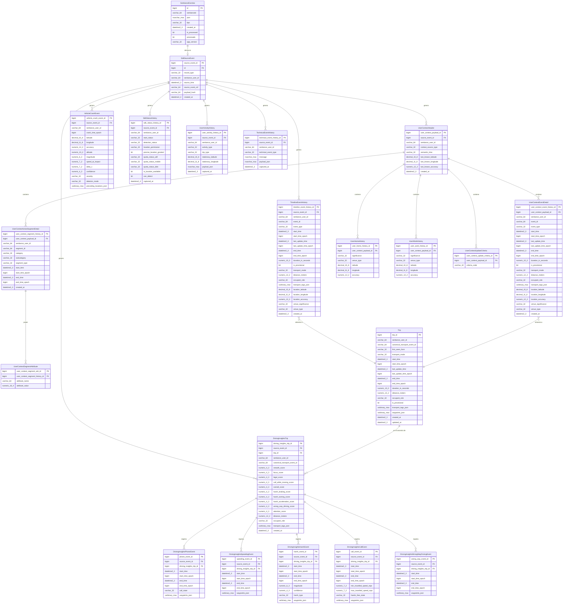
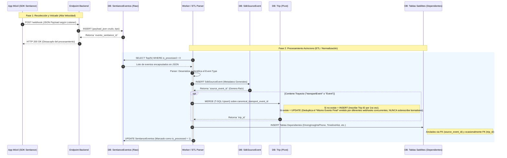

# Diseño de Base de Datos - Eventos Sentiance

> **Versión:** 1.0.0  
> **Última Actualización:** 30 de marzo de 2026  
> **Motor Objetivo:** Microsoft SQL Server (T-SQL)

## 1. Contexto y Origen de Datos (Payloads)

Este modelo de base de datos está diseñado para almacenar estructuradamente la información recolectada por el **SDK de Sentiance** en aplicaciones móviles.

La información ingresa al backend mediante **eventos recibidos a través de los *listeners* del SDK en el dispositivo móvil** (en nuestro caso, bajo la implementación de React Native). 

**Puntos Importantes:**

- **Solo Listeners:** No se consolida información proveniente de los volcados diarios (Offloads). El stream es un pipeline directo donde la app móvil emite el payload JSON directamente al backend.
- **Formato Crudo (Raw):** El JSON almacenado inicialmente en la tabla `SentianceEventos` es el payload exacto emitido por el SDK, sin agregados, sobres ni modificaciones de parte del backend.  Si bien la idea es comprimir el mensaje antes de enviarlo, mi propuesta es guardarlo descompactado y legible por humanos para facilitar el debugging. El presente esquema propuesto permite purgar periódicamente esta tabla de modo que no hay peligro de un crecimiento descontrolado de la necesidad de almacenamiento.
- **Múltiples Fuentes de Viajes (`Trip`):** La entidad central `Trip` (viaje) no proviene de un solo payload. Es una tabla normalizada alimentada por múltiples fuentes: Eventos temporales (`TimelineEvent` o del `UserContext`) especialmente útiles para viajes cortos, peatonales, bicicletas o colectivos, y objetos de `DrivingInsights` para trayectos motorizados de autos/motos.

---

## 2. Diagrama Entidad-Relación (ER)



---

## 3. Diccionario de Datos (Mapeo por Tabla)

> **📍 MOTOR OBJETIVO: Microsoft SQL Server (T-SQL)**  
> Todo el esquema ER y el Diccionario de Datos están pensados estructuralmente para ser implementados en **Microsoft SQL Server**.
> - Campos booleanos lógicos se expresan como `BIT` (`0` / `1`).
> - **Compresión de arreglos extensos:** Los campos volumétricos de metadatos variables como `transport_tags_json`, `waypoints_json` y `preceding_locations_json` se tipifican rigurosamente como **`VARBINARY(MAX)`**. Esto impone que el Backend serialice la cadena JSON usando CBOR o una función de compresión (como GZIP) antes del `INSERT`, ahorrando entre 60% y 80% de disco a costa de perder capacidades de escaneo directo (*JSON_VALUE*) intradata, las cuales son irrelevantes en arreglos kilométricos de coordenadas.

---

### 2.1. Política de Retención y Purga de Telemetría (Data Life-Cycle)

Debido al volumen incuantificable de datos espaciales recopilados mediante lecturas GPS contínuas (1 coordenada por segundo en `Trip` y en Insights), el esquema exige la siguiente política de compactación en frío para prevenir el fallo catastrófico por saturación (bloat) del almacenamiento en SQL Server:

1. **Hot Stage (Datos Activos - 0 a 90 días):** La información se conserva 100% intacta y comprimida. Los campos binarios `waypoints_json` y `transport_tags_json` mantienen el trayecto topográfico inmutable para reportes fluidos, trazados exactos en mapas de la App, y posibles disputas legales de colisiones.
2. **Cold Purge (Recesión de metadatos volumétricos - > 90 días):** Un proceso/Job programado nocturno debe setear a `NULL` el campo masivo `waypoints_json` y `transport_tags_json` para los viajes de más de 3 meses de antigüedad. **La fila de la tabla y la existencia del viaje se conservan de por vida**, manteniendo todos los scorings predictivos (`overall_score`), timestamps, duraciones en segundos, y contadores analíticos vitales totalmente intactos. Únicamente se sacrifica el *"dibujo"* granular del trayecto GPS para ahorrar masivamente capacidades computacionales y de disco.
> - Columnas numéricas usan `NUMERIC`, `DECIMAL` o `BIGINT` en lugar de literales genéricos para garantizar exactitud temporal y espacial.

> A continuación, se detalla campo por campo cada tabla presente en el diagrama, vinculándola con la variable equivalente dictada por la documentación  de Sentiance react-native.

### 3.1. Tablas Base y Gestión

#### 3.1.1. `SentianceEventos`

Tabla originaria donde el backend "aterriza" la recepción del payload de la app móvil (Listener raw).


| Campo          | Tipo          | Mapeo Sentiance                                                                                                                                                              |
| -------------- | ------------- | ---------------------------------------------------------------------------------------------------------------------------------------------------------------------------- |
| `id`           | BIGINT (PK)   | Auto-Generado Interno (IDENTITY 1,1)                                                                                                                                         |
| `sentianceid`  | VARCHAR(64)   | Identificador del usuario.                                                                                                                                                   |
| `json`         | NVARCHAR(MAX) | **Payload exacto emitido desde la app React Native**.                                                                                                                        |
| `tipo`         | VARCHAR(32)   | Tipo de Listener (Ej. `UserContextUpdate`, `TimelineUpdate`, `DrivingInsightsReady`, `CrashEvent`)                                                                           |
| `created_at`   | DATETIME2(3)  | Marca de tiempo asignada por el servidor backend de forma local al instante de recepcionar el webhook HTTP (ej. `GETDATE()`)                                                 |
| `is_processed` | BIT           | Flag nativo de control de este pipeline ETL (Extract -> Transform -> Load): seteado a `1` una vez el JSON fue parseado y distribuido exitosamente a las tablas normalizadas. |
| `procesado`    | BIT           | **⚠️ LEGACY / EXTERNO:** Flag preexistente manipulado por rutinas ajenas a esta integración. No tiene relación alguna con este pipeline documental. **Ignorar**.             |
| `app_version`  | VARCHAR(32)   | Custom Backend (versión de la App si se inyecta en headers HTTP/URL).                                                                                                        |


> **📊 Valores de `tipo` observados en producción — últimos 60 días** *(consulta ejecutada: 2026-04-04)*
>
> | `tipo` | Registros | Último registro |
> | --- | ---: | --- |
> | `DrivingInsights` | 7.726 | 2026-04-04 |
> | `requestUserContext` | 5.518 | 2026-04-04 |
> | `UserContextUpdate` | 1.765 | 2026-04-04 |
> | `SDKStatus` | 1.275 | 2026-04-04 |
> | `VehicleCrash` | 166 | 2026-03-31 |
> | `DebugLog` | 150 | 2026-03-16 |
> | `TimelineEvents` | 35 | 2026-02-25 |
> | `DrivingInsightsPhoneEvents` | 26 | 2026-04-01 |
> | `DrivingInsightsHarshEvents` | 15 | 2026-04-01 |
> | `DrivingInsightsSpeedingEvents` | 9 | 2026-04-01 |
> | `DrivingInsightsCallEvents` | 2 | 2026-03-04 |
> | `DrivingInsightsWrongWayDrivingEvents` | 0 | 2026-03-04 |
>
> **📝 Notas de nomenclatura y análisis de tipos observados:**
>
> **1. Equivalencias de nombres (producción vs. documentación):**
> Los valores reales de `tipo` en producción difieren de los ejemplos documentados en el campo. Equivalencias confirmadas:
>
> | Valor en producción | Nombre en documentación SDK |
> | --- | --- |
> | `DrivingInsights` | `DrivingInsightsReady` |
> | `TimelineEvents` | `TimelineUpdate` |
> | `VehicleCrash` | `CrashEvent` |
> | `SDKStatus` | `SdkStatus` |
>
> **2. Análisis de `requestUserContext` vs. `UserContextUpdate`:**
>
> Son **dos mecanismos paralelos e independientes** que producen el mismo tipo de dato (`UserContext`) pero por rutas distintas:
>
> | Característica | `requestUserContext` | `UserContextUpdate` |
> | --- | --- | --- |
> | **Origen** | Llamada **manual** de la app (`SentianceUserContext.requestUserContext()`) | Listener **automático** del SDK (`addUserContextUpdateListener`) |
> | **Disparo** | A demanda, cuando la app necesita el contexto actual | Automático ante cambios de contexto (nuevo evento, segmento activo, venue visitado) |
> | **Estructura JSON raíz** | `UserContext` plano (sin wrapper) | `UserContextUpdate` con wrapper |
> | **Campo `criteria`** | ❌ Ausente | ✅ Presente (`"CURRENT_EVENT"`, `"ACTIVE_SEGMENTS"`, `"VISITED_VENUES"`) |
> | **Registros (60 días)** | **5.518** | **1.765** |
> | **Procesado por el ETL** | ❌ Ignorado actualmente | ✅ Mapeado a tablas de dominio |
>
> **Estructura JSON comparada** (confirmada por muestras reales de la base de datos):
>
> ```json
> // requestUserContext → UserContext PLANO (sin criteria ni wrapper)
> {
>   "semanticTime": "LUNCH",
>   "lastKnownLocation": { "accuracy": 10, "longitude": -58.336, "latitude": -34.753 },
>   "activeSegments": [ { "startTime": "...", "attributes": [...] } ],
>   "events": [...], "home": {...}, "work": {...}
> }
>
> // UserContextUpdate → WRAPPEA UserContext + agrega criteria
> {
>   "criteria": ["VISITED_VENUES"],
>   "userContext": {
>     "lastKnownLocation": { "accuracy": 3, "longitude": -58.454, "latitude": -34.561 },
>     "activeSegments": [...],
>     "events": [...], "home": {...}, "work": {...}
>   }
> }
> ```
>
> **⚠️ Implicación para el ETL:** Los **5.518 registros** `requestUserContext` contienen datos de `UserContext` exactamente del mismo tipo que el campo `userContext` dentro de `UserContextUpdate`. Representan **un 75% adicional** sobre el volumen actual de `UserContextUpdate` procesados, actualmente ignorado.
>
> **Detalle de la "adaptación mínima" necesaria para procesarlos:**
>
> El ETL actual para `UserContextUpdate` hace (conceptualmente):
> ```
> payload = parse_json(SentianceEventos.json)
> user_context = payload["userContext"]    ← accede al campo wrapper
> criteria     = payload["criteria"]       ← extrae el criterio de cambio
> → inserta en tablas de dominio usando user_context
> → inserta 1 fila en UserContextUpdateCriteria por cada elemento de criteria[]
> ```
> Para `requestUserContext`, la adaptación sería:
> ```
> payload = parse_json(SentianceEventos.json)
> user_context = payload                   ← el JSON raíz ES el UserContext directamente
> criteria     = ["MANUAL_REQUEST"]        ← valor sintético (no existe en el payload)
> → inserta en las MISMAS tablas de dominio con la MISMA lógica
> → inserta 1 fila en UserContextUpdateCriteria con criteria_code = 'MANUAL_REQUEST'
> ```
> Los **cambios de código** serían tres:
> 1. **Condición de tipo**: agregar `tipo = 'requestUserContext'` al `WHERE` de selección de registros a procesar.
> 2. **Ruta de extracción del JSON**: en lugar de `json["userContext"]`, leer `json` directamente como el objeto `UserContext`.
> 3. **Campo `criteria`**: asignar el valor sintético `"MANUAL_REQUEST"` al insertar en `UserContextUpdateCriteria`.
>
> Para el punto 3, hay dos alternativas a nivel de diseño:
>
> | | **Opción A** *(recomendada)* | **Opción B** |
> | --- | --- | --- |
> | **Acción** | Extender el `CHECK` constraint de `UserContextUpdateCriteria` para aceptar `'MANUAL_REQUEST'`. Insertar 1 fila con ese valor. | No insertar filas en `UserContextUpdateCriteria` para las entradas `requestUserContext`. |
> | **Cambio DDL** | ✅ Sí — `ALTER TABLE` sobre el constraint `chk_criteria_code` | ❌ Ninguno |
> | **Trazabilidad** | ✅ **Explícita**: cualquier consulta puede distinguir registros manuales de automáticos por el valor de `criteria_code`. | ⚠️ **Implícita**: el origen solo se deduce por ausencia de filas en `UserContextUpdateCriteria`, lo que es frágil y ambiguo (¿bug del ETL o diseño?). |
> | **Consistencia del modelo** | ✅ Todo `UserContext` almacenado tiene al menos una fila en `UserContextUpdateCriteria`. | ❌ Rompe la relación 1-a-muchos esperada. |
>
> **✅ Decisión arquitectónica: Opción A.** Se prefiere la trazabilidad explícita del origen sobre el ahorro del `ALTER TABLE`. El DDL necesario es:
> ```sql
> ALTER TABLE UserContextUpdateCriteria DROP CONSTRAINT chk_criteria_code;
> ALTER TABLE UserContextUpdateCriteria ADD CONSTRAINT chk_criteria_code
>   CHECK (criteria_code IN ('CURRENT_EVENT', 'ACTIVE_SEGMENTS', 'VISITED_VENUES', 'MANUAL_REQUEST'));
> ```
>
> **3. `DebugLog`:** Logs internos de diagnóstico del SDK. Sin estructura de datos útil para el pipeline. Se descarta intencionalmente.


#### 3.1.2. `SdkSourceEvent`

Auditoría de los registros. Permite referenciar un objeto normalizado a su JSON originario.


| Campo               | Tipo      | Mapeo Interno                                                         |
| ------------------- | --------- | --------------------------------------------------------------------- |
| `source_event_id`   | BIGINT PK | Clave única autogenerada                                              |
| `id`                | BIGINT FK | Referencia al `id` de `SentianceEventos`                              |
| `record_type`       | VARCHAR(32) | Denominación del payload extraído (`CrashEvent`, `UserContext`, etc.) |
| `sentiance_user_id` | VARCHAR(64) | `user_id`                                                             |
| `source_time`       | DATETIME2(3)| Obtenido de los epoch del evento principal en el JSON                 |
| `source_event_ref`  | VARCHAR(64) | ID de referencia directa (`event.id` o `transportEvent.id`)           |
| `payload_hash`      | VARCHAR(64) | Hash MD5/SHA para determinar unicidad de JSONs procesados             |
| `created_at`        | DATETIME2(3)| Tiempo Interno de normalización                                       |


**Nota**: tal vez convendría guardar la fecha también en formato legible por 

humanos

### 3.2. Dominio de Módulo Temporal (Timeline Events)

#### 3.2.1. `TimelineEventHistory`

Eventos de línea de tiempo del listener `addTimelineUpdateListener`.  
*Ref SDK: `react-native/event-timeline/timeline/definitions (Event Interface)*`


| Campo                       | Tipo          | Mapeo Sentiance       | JSON Detail                                                                                                                                                             |
| --------------------------- | ------------- | --------------------- | ----------------------------------------------------------------------------------------------------------------------------------------------------------------------- |
| `timeline_event_history_id` | BIGINT PK     | N/A                   | PK de tabla                                                                                                                                                             |
| `source_event_id`           | BIGINT FK     | N/A                   | Relación a `SdkSourceEvent`                                                                                                                                             |
| `sentiance_user_id`         | VARCHAR(64)   | `user_id`             | -                                                                                                                                                                       |
| `event_id`                  | VARCHAR(64)   | `id`                  | Id único del evento temporal. **Nota:** Si `event_type` es *"IN_TRANSPORT"*, este ID coincide exactamente con el `canonical_transport_event_id` de la tabla `**Trip**`. |
| `event_type`                | VARCHAR(32)   | `type`                | Enum estricto: *"UNKNOWN", "STATIONARY", "OFF_THE_GRID", "IN_TRANSPORT"*                                                                                                |
| `start_time`                | DATETIME2(3)  | `startTime`           | ISO 8601 string                                                                                                                                                         |
| `start_time_epoch`          | BIGINT        | `startTimeEpoch`      | UTC milisegundos                                                                                                                                                        |
| `last_update_time`          | DATETIME2(3)  | `lastUpdateTime`      | ISO 8601 string                                                                                                                                                         |
| `last_update_time_epoch`    | BIGINT        | `lastUpdateTimeEpoch` | UTC milisegundos                                                                                                                                                        |
| `end_time`                  | DATETIME2(3)  | `endTime`             | ISO 8601 string                                                                                                                                                         |
| `end_time_epoch`            | BIGINT        | `endTimeEpoch`        | UTC milisegundos                                                                                                                                                        |
| `duration_in_seconds`       | NUMERIC(10, 0)| `durationInSeconds`   | Nulo si no culminó                                                                                                                                                      |
| `is_provisional`            | BIT           | `isProvisional`       | Determina si es `true` (en curso) o `false` (final)                                                                                                                     |
| `transport_mode`            | VARCHAR(32)   | `transportMode`       | Enum estricto: *"UNKNOWN", "BICYCLE", "WALKING", "RUNNING", "TRAM", "TRAIN", "CAR", "BUS", "MOTORCYCLE"*                                                                |
| `distance_meters`           | NUMERIC(12, 2)| `distance`            | Distancia del transporte en metros                                                                                                                                      |
| `occupant_role`             | VARCHAR(32)   | `occupantRole`        | *"DRIVER", "PASSENGER", "UNAVAILABLE"*                                                                                                                                  |
| `transport_tags_json`       | VARBINARY(MAX)| `transportTags`       | String JSON del objeto Key-Value asignado.                                                                                                                              |
| `location_latitude`         | DECIMAL(10, 8)| `location.latitude`   | Presente sólo para `STATIONARY`                                                                                                                                         |
| `location_longitude`        | DECIMAL(11, 8)| `location.longitude`  | Presente sólo para `STATIONARY`                                                                                                                                         |
| `location_accuracy`         | NUMERIC(12, 2)| `location.accuracy`   | Precisión estacionaria (mts)                                                                                                                                            |
| `venue_significance`        | VARCHAR(32)   | `venue.significance`  | Enum estricto: *"UNKNOWN", "HOME", "WORK", "POINT_OF_INTEREST"*                                                                                                         |
| `venue_type`                | VARCHAR(32)   | `venue.type`          | Enum extenso con docenas de categorías (incluye *"UNKNOWN"*, *"SHOP_LONG"*, *"OFFICE"*, *"RESIDENTIAL"*, etc.)                                                          |


---

### 3.3. Dominio de Contexto de Usuario (User Context)

Derivados del Listener `addUserContextUpdateListener`.  
*Ref SDK: `react-native/user-context/definitions (UserContext)*`

#### 3.3.1. `UserContextHeader`

Contiene los datos básicos del objeto `UserContextUpdate` y sirve como punto de entrada para los segmentos y eventos que vienen en el mismo lote.

**Relación con Tablas Dependientes**:  
Para recuperar los datos asociados a una actualización, usa el `**source_event_id**` (Foreign Key):

- En `**UserContextSegmentHistory**` estarán los segmentos de este lote.
- En `**UserTimelineEventHistory**` estarán los eventos de este lote.

**Política de Inserción (UPSERT)**:  
Para evitar registros repetidos en el historial si un mismo evento llega en distintas actualizaciones:

1. **Eventos**: No duplicar si el `**event_id**` (Sentiance) ya existe.
2. **Segmentos**: No duplicar si el par `**(sentiance_user_id, segment_id)**` ya existe.


| Campo                     | Tipo      | Mapeo Sentiance               | Detalles                                                                                                                                 |
| ------------------------- | --------- | ----------------------------- | ---------------------------------------------------------------------------------------------------------------------------------------- |
| `user_context_payload_id` | BIGINT PK | N/A                           | Identificador único e incremental para cada registro de contexto recibido, sirviendo como raíz para las tablas de criterios y segmentos. |
| `source_event_id`         | BIGINT FK | N/A                           | PK SdkSourceEvent                                                                                                                        |
| `sentiance_user_id`       | VARCHAR(64) | N/A                           | ID Sentiance                                                                                                                             |
| `first_seen_from`         | VARCHAR(32) | N/A                           | Meta-origen: *"TIMELINE"* o *"USER_CONTEXT_LISTENER"*                                                                                    |
| `semantic_time`           | VARCHAR(32) | `userContext.semanticTime`    | *"MORNING", "LATE_MORNING", "NIGHT"*, etc.                                                                                               |
| `last_known_latitude`     | DECIMAL(10, 8)| `lastKnownLocation.latitude`  | Coordenada Y                                                                                                                             |
| `last_known_longitude`    | DECIMAL(11, 8)| `lastKnownLocation.longitude` | Coordenada X                                                                                                                             |
| `last_known_accuracy`     | NUMERIC(12, 2)| `lastKnownLocation.accuracy`  | Precisión                                                                                                                                |


#### 3.3.2. `UserContextUpdateCriteria`

Los motivos de actualización extraídos del arreglo `criteria[]`.


| Campo                             | Tipo      | Mapeo Sentiance                                                                                                                                                                                                                                                                                               |
| --------------------------------- | --------- | ------------------------------------------------------------------------------------------------------------------------------------------------------------------------------------------------------------------------------------------------------------------------------------------------------------- |
| `user_context_update_criteria_id` | BIGINT PK | Auto                                                                                                                                                                                                                                                                                                          |
| `user_context_payload_id`         | BIGINT FK | FK referenciando a `UserContextHeader(user_context_payload_id)`.                                                                                                                                                                                                                                              |
| `criteria_code`                   | VARCHAR(32) | Indica el motivo de la actualización. Un `UserContextUpdate` puede tener múltiples motivos simultáneos (ej. cambió el evento y se actualizaron segmentos), por lo que se debe insertar un registro por cada elemento del array recibido. Valores: *"CURRENT_EVENT"*, *"ACTIVE_SEGMENTS"*, *"VISITED_VENUES"*. |


#### 3.3.3. `UserContextEventDetail`

Itera los eventos activos `events[]` actuales del contexto.  
Mapeo idéntico a `TimelineEventHistory` porque ambos usan el modelo `Event` (contiene `transportMode`, `occupantRole`, locations y demás). Única diferencia: Clave Foránea a `UserContextHeader`.

> **⚠️ Nota de Normalización y Almacenamiento:** Aunque el objeto nativo extraído `events[]` contiene un voluminoso array de `waypoints` (coordenadas en milisegundos del trayecto), este campo fue **omitido intencionalmente** del esquema `UserContextEventDetail`. Para evitar duplicidad extrema de Megabytes en JSON, dichos recorridos se almacenan de manera única en la tabla pivote `**Trip**`.

> **⚠️ Nota sobre `venue.location`:** El SDK modela `venue.location` como un `GeoLocation` independiente de `event.location`. Sin embargo, para eventos `STATIONARY` ambos coinciden en la práctica (el venue se infiere a partir de la ubicación del evento). Adicionalmente, Sentiance usa Venue Type Mapping deliberadamente impreciso por privacidad y no expone ubicaciones exactas de venues. Por estos motivos, `venue.location` se **omite intencionalmente** y se retiene únicamente `event.location` (columnas `location_latitude/longitude/accuracy`). Esta misma omisión aplica a la tabla `TimelineEventHistory`.

#### 3.3.4. `UserContextActiveSegmentDetail`

Desgloce de la lista `activeSegments[]` del usuario (Comportamientos/Segmentos inferidos).


| Campo                             | Tipo              | Mapeo Sentiance                                                  |
| --------------------------------- | ----------------- | ---------------------------------------------------------------- |
| `user_context_segment_history_id` | BIGINT PK         | ID Interno                                                       |
| `user_context_payload_id`         | BIGINT FK         | FK referenciando a `UserContextHeader(user_context_payload_id)`. |
| `sentiance_user_id`               | VARCHAR(64)       | ID Sentiance                                                     |
| `segment_id`                      | VARCHAR(64)       | `id` (Identificador del Segmento)                                |
| `category`                        | VARCHAR(32)       | `category` (*"LEISURE", "MOBILITY", "WORK_LIFE"*)                |
| `subcategory`                     | VARCHAR(32)       | `subcategory` (*"SHOPPING", "SOCIAL", "TRANSPORT"*)              |
| `segment_type`                    | VARCHAR(32)       | `type` (*"CITY_WORKER", "EARLY_BIRD", "RESTO_LOVER"*)            |
| `start_time` / `start_time_epoch` | DATETIME2(3) / BIGINT | `startTime` / `startTimeEpoch`                                   |
| `end_time` / `end_time_epoch`     | DATETIME2(3) / BIGINT | `endTime` / `endTimeEpoch`                                       |


#### 3.3.5. `UserContextSegmentAttribute`

Iterado mediante objeto secundario `attributes[]` hijo del arreglo `activeSegments[]`.


| Campo                             | Tipo      | Mapeo Sentiance                                                                               |
| --------------------------------- | --------- | --------------------------------------------------------------------------------------------- |
| `user_context_segment_attr_id`    | BIGINT PK     | Auto                                                                                         |
| `user_context_segment_history_id` | BIGINT FK | FK referenciando a `UserContextActiveSegmentDetail(user_context_segment_history_id)`.        |
| `attribute_name`                  | VARCHAR(64) | `name` (Ej. `home_time`, `arrival_time_weekday`, etc.)                                     |
| `attribute_value`                 | NUMERIC(18, 4)| `value` (Valor del atributo)                                                               |


#### 3.3.6. `UserHomeHistory` y `UserWorkHistory`

Lugares frecuentes estables `home` y `work` del `UserContext`.


| Campo                           | Tipo      | Mapeo Sentiance                                                  |
| ------------------------------- | --------- | ---------------------------------------------------------------- |
| `user_home_history_id` (o work) | BIGINT PK | Auto                                                             |
| `user_context_payload_id`       | BIGINT FK | FK referenciando a `UserContextHeader(user_context_payload_id)`. |
| `significance`                  | VARCHAR(32) | `significance` (*"HOME" / "WORK"*)                               |
| `venue_type`                    | VARCHAR(32) | `type` (*"RESIDENTIAL", "OFFICE"*)                               |
| `latitude`                      | DECIMAL(10, 8)| `location.latitude`                                              |
| `longitude`                     | DECIMAL(11, 8)| `location.longitude`                                             |
| `accuracy`                      | NUMERIC(12, 2)| `location.accuracy`                                              |


---

### 3.4. Dominio de Hábitos Conductuales de Manejo (Driving Insights)

Vienen del listener `addDrivingInsightsReadyListener`, gatillado en transportes finalizados. Deben incluir a través de la app todas las llamadas auxiliares (`getHarshDrivingEvents`, `getCallWhileMovingEvents` etc.) encoladas en el JSON enviado al backend.  
*Ref SDK: `react-native/driving-insights/definitions*`

#### 3.4.1. `DrivingInsightsTrip`

Mapeo principal de `DrivingInsights` (contiene `transportEvent` y `safetyScores`).

> **⚠️ Nota de Normalización (Omisión de Waypoints):** A pesar de que el objeto nativo extraído `transportEvent` contiene un array pesado de `waypoints` (tracking geoespacial a milisegundos), esta propiedad fue **purgada intencionalmente** del mapeo DDL de `DrivingInsightsTrip`. Para eficientizar el almacenamiento y evitar gigabytes de coordenadas duplicadas, el guardado de `waypoints_json` de todos los viajes se delega de forma exclusiva y consolidada a la tabla canónica central `**Trip**`.


| Campo                      | Tipo          | Mapeo Sentiance                       | Notas                                                     |
| -------------------------- | ------------- | ------------------------------------- | --------------------------------------------------------- |
| `driving_insights_trip_id` | BIGINT PK     | -                                     | -                                                         |
| `source_event_id`          | BIGINT FK     | -                                     | FK referenciando a `SdkSourceEvent(source_event_id)`.     |
| `trip_id`                  | BIGINT FK     | -                                     | FK referenciando a la tabla canónica `Trip(trip_id)`.     |
| `sentiance_user_id`        | VARCHAR(64)   | -                                     | Sentiance Id                                              |
| `canonical_transport_event_id` | VARCHAR(64)   | `transportEvent.id`                   | **Clave de Unicidad**: ID oficial del viaje proporcionada por la Timeline. |
| `smooth_score`             | NUMERIC(4, 3) | `safetyScores.smoothScore`            | (0 a 1)                                                   |
| `focus_score`              | NUMERIC(4, 3) | `safetyScores.focusScore`             | (0 a 1)                                                   |
| `legal_score`              | NUMERIC(4, 3) | `safetyScores.legalScore`             | (0 a 1)                                                   |
| `call_while_moving_score`  | NUMERIC(4, 3) | `safetyScores.callWhileMovingScore`   | (0 a 1)                                                   |
| `overall_score`            | NUMERIC(4, 3) | `safetyScores.overallScore`           | (0 a 1)                                                   |
| `harsh_braking_score`      | NUMERIC(4, 3) | `safetyScores.harshBrakingScore`      | (0 a 1)                                                   |
| `harsh_turning_score`      | NUMERIC(4, 3) | `safetyScores.harshTurningScore`      | (0 a 1)                                                   |
| `harsh_acceleration_score` | NUMERIC(4, 3) | `safetyScores.harshAccelerationScore` | (0 a 1)                                                   |
| `wrong_way_driving_score`  | NUMERIC(4, 3) | `safetyScores.wrongWayDrivingScore`  | (0 a 1)                                                   |
| `attention_score`          | NUMERIC(4, 3) | `safetyScores.attentionScore`       | (0 a 1)                                                   |
| `distance_meters`          | NUMERIC(12, 2)| `transportEvent.distance`             | Distancia extraída en metros                              |
| `occupant_role`            | VARCHAR(32)   | `transportEvent.occupantRole`         | Enum estricto: *"DRIVER"*, *"PASSENGER"*, *"UNAVAILABLE"* |
| `transport_tags_json`      | VARBINARY(MAX)| `transportEvent.transportTags`        | Serializado dict key-value                                |


#### 3.4.2. `DrivingInsightsHarshEvent`

Deriva de `getHarshDrivingEvents()`.


| Campo                      | Tipo          | Mapeo Sentiance                              | Notas                                                                      |
| -------------------------- | ------------- | -------------------------------------------- | -------------------------------------------------------------------------- |
| `harsh_event_id`           | BIGINT PK     | Auto                                         | Identificador único del evento brusco.                                     |
| `source_event_id`          | BIGINT FK     | FK Raíz                                      | FK referenciando a `SdkSourceEvent(source_event_id)`.                      |
| `driving_insights_trip_id` | BIGINT FK     | FK Padre                                     | FK referenciando a `DrivingInsightsTrip(driving_insights_trip_id)`.        |
| `start_time`               | DATETIME2(3)  | `startTime`                                  | Inicio del evento.                                                         |
| `start_time_epoch`         | BIGINT        | `startTimeEpoch`                             | Tiempo Unix de inicio.                                                     |
| `end_time`                 | DATETIME2(3)  | `endTime`                                    | Fin del evento.                                                            |
| `end_time_epoch`           | BIGINT        | `endTimeEpoch`                               | Tiempo Unix de fin.                                                        |
| `magnitude`                | NUMERIC(6, 3) | `magnitude`                                  | Fuerza G máxima detectada.                                                 |
| `confidence`               | NUMERIC(4, 3) | `confidence`                                 | Nivel de confianza (0-1).                                                  |
| `harsh_type`               | VARCHAR(32)   | `type` (*"ACCELERATION", "BRAKING", "TURN"*) | Tipo de evento brusco.                                                     |
| `waypoints_json`           | VARBINARY(MAX)| `waypoints[]`                                | Array completo de puntos del evento (Lat/Long/Alt) en formato JSON string. |


#### 3.4.3. `DrivingInsightsCallEvent`

Deriva de llamadas auxiliares a `getPhoneUsageEvents()` y `getCallWhileMovingEvents()`.

> **💡 Nota de Nomenclatura (Frontend vs Backend):** Oficialmente, en el contrato y documentación TypeScript de Sentiance, los objetos de llamadas mientras se maneja están empaquetados bajo la interfaz `CallWhileMovingEvent`. En esta Base de Datos se denominó explícitamente a la tabla como `**DrivingInsightsCallEvent**` por mera consistencia de diseño para estandarizar todos los "insights" vehiculares. Por lo tanto: `**CallWhileMovingEvent` ≡ `DrivingInsightsCallEvent**`.


| Campo                      | Tipo          | Mapeo Sentiance        | Notas                                                               |
| -------------------------- | ------------- | ---------------------- | ------------------------------------------------------------------- |
| `call_event_id`            | BIGINT PK     | Auto                   | Identificador único del evento de llamada.                          |
| `source_event_id`          | BIGINT FK     | FK Raíz                | FK referenciando a `SdkSourceEvent(source_event_id)`.               |
| `driving_insights_trip_id` | BIGINT FK     | FK Padre               | FK referenciando a `DrivingInsightsTrip(driving_insights_trip_id)`. |
| `start_time`               | DATETIME2(3)  | `startTime`            | Inicio de la llamada.                                               |
| `start_time_epoch`         | BIGINT        | `startTimeEpoch`       | Tiempo Unix de inicio.                                              |
| `end_time`                 | DATETIME2(3)  | `endTime`              | Fin de la llamada.                                                  |
| `end_time_epoch`           | BIGINT        | `endTimeEpoch`         | Tiempo Unix de fin.                                                 |
| `min_travelled_speed_mps`  | NUMERIC(7, 2) | `minTravelledSpeedMps` | Velocidad mínima durante la llamada (metros por segundo).           |
| `max_travelled_speed_mps`  | NUMERIC(7, 2) | `maxTravelledSpeedMps` | Velocidad máxima durante la llamada (metros por segundo).           |
| `hands_free_state`         | VARCHAR(32)   | `handsFreeState`       | Estado de manos libres (*"HANDS_FREE", "HANDHELD", "UNAVAILABLE"*). |
| `waypoints_json`           | VARBINARY(MAX)| `waypoints[]`          | Array de puntos del evento (Lat/Long/Alt) en formato JSON string.   |


#### 3.4.4. `DrivingInsightsSpeedingEvent`

Deriva de `getSpeedingEvents()`.


| Campo                      | Tipo          | Mapeo Sentiance  | Notas                                                               |
| -------------------------- | ------------- | ---------------- | ------------------------------------------------------------------- |
| `speeding_event_id`        | BIGINT PK     | Auto             | Identificador único del evento de exceso de velocidad.              |
| `source_event_id`          | BIGINT FK     | FK Raíz          | FK referenciando a `SdkSourceEvent(source_event_id)`.               |
| `driving_insights_trip_id` | BIGINT FK     | FK Padre         | FK referenciando a `DrivingInsightsTrip(driving_insights_trip_id)`. |
| `start_time`               | DATETIME2(3)  | `startTime`      | Inicio del exceso de velocidad.                                     |
| `start_time_epoch`         | BIGINT        | `startTimeEpoch` | Tiempo Unix de inicio.                                              |
| `end_time`                 | DATETIME2(3)  | `endTime`        | Fin del exceso de velocidad.                                        |
| `end_time_epoch`           | BIGINT        | `endTimeEpoch`   | Tiempo Unix de fin.                                                 |
| `waypoints_json`           | VARBINARY(MAX)| `waypoints[]`    | Array de puntos del evento (Lat/Long/Alt) en formato JSON string.   |


#### 3.4.5. `DrivingInsightsWrongWayDrivingEvent`

Deriva de `getWrongWayDrivingEvents()`.


| Campo                      | Tipo          | Mapeo Sentiance  | Notas                                                               |
| -------------------------- | ------------- | ---------------- | ------------------------------------------------------------------- |
| `wrong_way_event_id`       | BIGINT PK     | Auto             | Identificador único del evento de conducción en contramano.         |
| `source_event_id`          | BIGINT FK     | FK Raíz          | FK referenciando a `SdkSourceEvent(source_event_id)`.               |
| `driving_insights_trip_id` | BIGINT FK     | FK Padre         | FK referenciando a `DrivingInsightsTrip(driving_insights_trip_id)`. |
| `start_time`               | DATETIME2(3)  | `startTime`      | Inicio de la conducción en contramano.                              |
| `start_time_epoch`         | BIGINT        | `startTimeEpoch` | Tiempo Unix de inicio.                                              |
| `end_time`                 | DATETIME2(3)  | `endTime`        | Fin de la conducción en contramano.                                 |
| `end_time_epoch`           | BIGINT        | `endTimeEpoch`   | Tiempo Unix de fin.                                                 |
| `waypoints_json`           | VARBINARY(MAX)| `waypoints[]`    | Array de puntos del evento (Lat/Long/Alt) en formato JSON string.   |


#### 3.4.6. `DrivingInsightsPhoneEvent`

Deriva de `getPhoneUsageEvents()`. Representa los momentos en que el conductor interactúa con el teléfono móvil durante el trayecto.

| Campo                      | Tipo          | Mapeo Sentiance  | Notas                                                               |
| -------------------------- | ------------- | ---------------- | ------------------------------------------------------------------- |
| `phone_event_id`           | BIGINT PK     | Auto             | Identificador único del evento de distracción.                      |
| `source_event_id`          | BIGINT FK     | FK Raíz          | FK referenciando a `SdkSourceEvent(source_event_id)`.               |
| `driving_insights_trip_id` | BIGINT FK     | FK Padre         | FK referenciando a `DrivingInsightsTrip(driving_insights_trip_id)`. |
| `start_time`               | DATETIME2(3)  | `startTime`      | Inicio del uso del teléfono.                                        |
| `start_time_epoch`         | BIGINT        | `startTimeEpoch` | Tiempo Unix de inicio.                                              |
| `end_time`                 | DATETIME2(3)  | `endTime`        | Fin del uso del teléfono.                                           |
| `end_time_epoch`           | BIGINT        | `endTimeEpoch`   | Tiempo Unix de fin.                                                 |
| `call_state`               | VARCHAR(32)   | `callState`      | Estado de llamada (*"NO_CALL", "CALL_IN_PROGRESS", "UNAVAILABLE"*). |
| `waypoints_json`           | VARBINARY(MAX)| `waypoints[]`    | Array de puntos del evento (Lat/Long/Alt) en formato JSON string.   |

---

### 3.5. Excepciones Vehiculares y Estado

#### 3.5.1. `VehicleCrashEvent`

Provisto a través de `addVehicleCrashEventListener`.  
*Ref SDK: `react-native/crash-detection/definitions*`


| Campo                      | Tipo          | Mapeo Sentiance                                   | Notas                                                 |
| -------------------------- | ------------- | ------------------------------------------------- | ----------------------------------------------------- |
| `vehicle_crash_event_id`   | BIGINT PK     | Auto                                              | Identificador único del evento de choque.             |
| `source_event_id`          | BIGINT FK     | FK Raíz                                           | FK referenciando a `SdkSourceEvent(source_event_id)`. |
| `sentiance_user_id`        | VARCHAR(64)   | -                                                 | ID del usuario de Sentiance.                          |
| `crash_time_epoch`         | BIGINT        | `time`                                            | Tiempo Unix del impacto.                              |
| `latitude`                 | DECIMAL(10, 8)| `location.latitude`                               | Coordenada Y del impacto.                             |
| `longitude`                | DECIMAL(11, 8)| `location.longitude`                              | Coordenada X del impacto.                             |
| `accuracy`                 | NUMERIC(12, 2)| `location.accuracy`                               | Precisión del GPS al momento del impacto.             |
| `altitude`                 | NUMERIC(10, 2)| `location.altitude`                               | Altitud al momento del impacto.                       |
| `magnitude`                | NUMERIC(6, 3) | `magnitude`                                       | Magnitud del choque.                                  |
| `speed_at_impact`          | NUMERIC(7, 2) | `speedAtImpact`                                   | Velocidad al momento del impacto.                     |
| `delta_v`                  | NUMERIC(7, 2) | `deltaV`                                          | Cambio de velocidad inducido por el impacto.          |
| `confidence`               | NUMERIC(4, 3) | `confidence`                                      | Nivel de confianza del sensor (0-1).                  |
| `severity`                 | VARCHAR(32)   | `severity`                                        | Gravedad (*"LOW", "MEDIUM", "HIGH"*).                 |
| `detector_mode`            | VARCHAR(32)   | `detectorMode` (*"CAR", "TWO_WHEELER"*)           |                                                       |
| `preceding_locations_json` | VARBINARY(MAX)| Stringificado del JSON Array `precedingLocations` |                                                       |


#### 3.5.2. `SdkStatusHistory`

Estado general de recolección en los dispositivos a través del listener de status updates. Mapeado desde el payload nativo `SdkStatus`.

> **⚠️ Nota de Captura Parcial (Muestreo Intencional):** La interfaz original TypeScript `SdkStatus` expone numeramente docenas de propiedades y banderas técnicas (tales como `userExists`, `backgroundRefreshStatus`, `isRemoteEnabled`, `isBatteryOptimizationEnabled`, `isAirplaneModeEnabled`, etc.). El modelo de base de datos optó por registrar de forma controlada estrictamente un subset de sus atributos, priorizando aquellos vinculados al cuote de tracking y localización ("is_location_available", "location_permission", etc., que componen la tabla relacional) para así mitigar la saturación de ruido técnico y maximizar el rendimiento DB. Por ende, la abstracción tabular en `SdkStatusHistory` se trata de un filtrado parcial e intencional, y no de un Mapeo Estructural 1:1 directo de todos los flag del SDK Status original.


| Campo                      | Tipo      | Mapeo Sentiance y Detalles                            | Notas                             |
| -------------------------- | --------- | ----------------------------------------------------- | --------------------------------- |
| `sdk_status_history_id`    | BIGINT PK | Auto                                                  | -                                 |
| `source_event_id`          | BIGINT FK | FK referenciando a `SdkSourceEvent(source_event_id)`. | -                                 |
| `sentiance_user_id`        | VARCHAR(64) | Identificador del usuario.                            | -                                 |
| `start_status`             | VARCHAR(32) | `startStatus`                                         | Estado de arranque del SDK.       |
| `detection_status`         | VARCHAR(32) | `detectionStatus`                                     | Estado operativo de detección.    |
| `location_permission`      | VARCHAR(32) | `locationPermission`                                  | Permisos del sistema operativo.   |
| `precise_location_granted` | BIT       | `isPreciseLocationGranted`                            | Si se tiene precisión GPS total.  |
| `quota_status_wifi`        | VARCHAR(32) | `quotaStatusWiFi`                                     | Estado de cuota en WiFi.          |
| `quota_status_mobile`      | VARCHAR(32) | `quotaStatusMobile`                                   | Estado de cuota en datos móviles. |
| `quota_status_disk`        | VARCHAR(32) | `quotaStatusDisk`                                     | Estado de cuota en disco.         |
| `is_location_available`    | BIT       | `isLocationAvailable`                                 | Si la ubicación está encendida.   |
| `can_detect`               | BIT       | `canDetect`                                           | Si el SDK puede recolectar datos. |
| `captured_at`              | DATETIME2(3)| Instante de persistencia del status.                  | -                                 |


#### 3.5.3. `UserActivityHistory`

Recopilación de contextos gruesos emitidos por el listener de User Activity. Mapeado del payload nativo `UserActivity`.


| Campo                      | Tipo          | Mapeo Sentiance y Detalles                                                   | Notas |
| -------------------------- | ------------- | ---------------------------------------------------------------------------- | ----- |
| `user_activity_history_id` | BIGINT PK     | Auto                                                                         | -     |
| `source_event_id`          | BIGINT FK     | FK referenciando a `SdkSourceEvent(source_event_id)`.                        | -     |
| `sentiance_user_id`        | VARCHAR(64)   | Identificador del usuario.                                                   | -     |
| `activity_type`            | VARCHAR(32)   | `type` (Ej. *"USER_ACTIVITY_TYPE_TRIP"*, *"USER_ACTIVITY_TYPE_STATIONARY"*). | -     |
| `trip_type`                | VARCHAR(32)   | `tripInfo.type`. Solo si la actividad es de tipo viaje.                      | -     |
| `stationary_latitude`      | DECIMAL(10, 8)| `stationaryInfo.location.latitude`. **⚠️ Permite NULL** si no hay señal.     | -     |
| `stationary_longitude`     | DECIMAL(11, 8)| `stationaryInfo.location.longitude`. **⚠️ Permite NULL** si no hay señal.    | -     |
| `payload_json`             | NVARCHAR(MAX) | Copia raw del JSON `UserActivity`.                                           | -     |
| `captured_at`              | DATETIME2(3)  | Instante de persistencia de la actividad.                                    | -     |


#### 3.5.4. `TechnicalEventHistory`

Logueo de advertencias o errores nativos del SDK, para debugging en servidor sin depender del volcado Offload (Payload sujeto a implementación de logger).


| Campo                        | Tipo          | Mapeo Sentiance y Detalles                                        | Notas |
| ---------------------------- | ------------- | ----------------------------------------------------------------- | ----- |
| `technical_event_history_id` | BIGINT PK     | Auto                                                              | -     |
| `source_event_id`            | BIGINT FK     | FK referenciando a `SdkSourceEvent(source_event_id)`.             | -     |
| `sentiance_user_id`          | VARCHAR(64)   | Identificador del usuario.                                        | -     |
| `technical_event_type`       | VARCHAR(32)   | Tipo de evento técnico (ej: *"ERROR"*, *"WARNING"*, *"SDK_LOG"*). | -     |
| `message`                    | NVARCHAR(MAX) | Descripción textual del evento o error.                           | -     |
| `payload_json`               | NVARCHAR(MAX) | Contenido crudo del log técnico para análisis profundo.           | -     |
| `captured_at`                | DATETIME2(3)  | Instante de persistencia del evento.                              | -     |


---

### 3.6. Tabla Integrada / Pivot ("Canon")

#### 3.6.1. `Trip`

**Importantísimo**: No es directamente poblada por un listener JSON Sentiance unitario, sino un integrador de viajes (Transports).


| Campo                          | Tipo          | Mapeo Sentiance       | Notas                                                                         |
| ------------------------------ | ------------- | --------------------- | ----------------------------------------------------------------------------- |
| `trip_id`                      | BIGINT PK     | Auto                  | Identificador único del viaje (consolidado).                                  |
| `sentiance_user_id`            | VARCHAR(64)   | -                     | ID del usuario de Sentiance.                                                  |
| `canonical_transport_event_id` | VARCHAR(64)   | `id` (del transporte) | ID original de Sentiance para de-duplicación global.                          |
| `first_seen_from`              | VARCHAR(32)   | -                     | Origen del primer registro (*"TIMELINE"*, *"CONTEXT"*, *"DRIVING_INSIGHTS"*). |
| `transport_mode`               | VARCHAR(32)   | `transportMode`       | Modo de transporte (CAR, BUS, WALKING, etc.).                                 |
| `start_time`                   | DATETIME2(3)  | `startTime`           | Inicio global del viaje.                                                      |
| `start_time_epoch`             | BIGINT        | `startTimeEpoch`      | Tiempo Unix de inicio.                                                        |
| `last_update_time`             | DATETIME2(3)  | `lastUpdateTime`      | Fecha de la última actualización reportada por el SDK.                        |
| `last_update_time_epoch`       | BIGINT        | `lastUpdateTimeEpoch` | Tiempo Unix de la última actualización.                                       |
| `end_time`                     | DATETIME2(3)  | `endTime`             | Fin global del viaje (si ha finalizado).                                      |
| `end_time_epoch`               | BIGINT        | `endTimeEpoch`        | Tiempo Unix de fin.                                                           |
| `duration_in_seconds`          | NUMERIC(10, 0)| `durationInSeconds`   | Duración total calculada en segundos.                                         |
| `distance_meters`              | NUMERIC(12, 2)| `distanceInMeters`    | Distancia total recorrida en metros.                                          |
| `occupant_role`                | VARCHAR(32)   | `occupantRole`        | Rol del ocupante (*"DRIVER"*, *"PASSENGER"*).                                 |
| `is_provisional`               | BIT           | `isProvisional`       | Flag para distinguir borradores de viajes finales definitivos.                |
| `transport_tags_json`          | VARBINARY(MAX)| `transportTags`       | Tags adicionales del transporte en formato JSON.                              |
| `waypoints_json`               | VARBINARY(MAX)| `waypoints[]`         | **Punto Único de Verdad**: Coordenadas consolidadas del viaje.                |
| `created_at`                   | DATETIME2(3)  | Auto                  | Fecha de creación técnica del registro.                                       |
| `updated_at`                   | DATETIME2(3)  | Auto                  | Fecha de última actualización técnica del registro.                           |


> **IMPORTANTE: Cómo trata el backend a los eventos provisionales y finales (`isProvisional`)**:  
> Según la documentación de Sentiance, los eventos provisionales generados en tiempo real **se generan independientemente a los finales y NO tienen el mismo ID**. 
> - A medida que el usuario se mueve, el SDK genera eventos provisorios en tiempo real (ej: "En movimiento IN_TRANSPORT") donde `isProvisional` es `true`. Estos se iteran e insertan en la tabla `Trip` como historias/segmentos. 
> - Una vez que el usuario se vuelve a quedar estacionario, Sentiance consolida todo el movimiento previo, procesa los scores y emite los eventos **Finales** (`isProvisional = false`). Los eventos finales tienen **IDs completamente nuevos** y Sentiance no provee links/claves foráneas apuntando a sus eventos "borrador" preliminares.
> - *↳ **Resultado en Base de Datos**: El backend **no actualiza ni reemplaza (UPDATE)** los records provisionales. Simplemente ingresa la nueva fila definitiva enviada por el evento final. Para análisis de scores de viaje limpio, reporting, o consumo en la UI usuaria final, la base de datos se debe filtrar buscando excluyentemente `WHERE is_provisional = 0` para aislar el output definitivo del viaje, descartando los borradores en tiempo real.*

> [!NOTE]
> **Nota Técnica de Implementación: Deduplicación vs Desvinculación de Viajes**  
> Es imperativo para el equipo de Backend (ETL) distinguir mecánicamente entre dos flujos totalmente diferentes al procesar identificadores (`canonical_transport_event_id`):
> 1. **Deduplicación de Evento Final (Uso de UPDATE / MERGE):** Cuando un "Viaje Final" concluye, múltiples módulos nativos de Sentiance (`UserContext`, `DrivingInsights`, `Timeline`) se disparan concurrentemente hacia la nube. Todos emiten de manera redundante el **mismo ID de viaje Final**. El backend debe usar `MERGE` en T-SQL para que el webhook que llegue primero realice el `INSERT` original, y los webhooks subsecuentes (que traen el mismo ID) realicen un `UPDATE`, enriqueciendo la fila única (ej. anexándole `waypoints` y Safety Scores).
> 2. **Desvinculación absoluta del Provisorio (Uso exclusivo de INSERT):** Los eventos en vivo emitidos en tiempo real (donde `isProvisional = true`) usan un ID propio que **no guarda relación alguna u originaria** con el ID del evento Final. El `MERGE` del webhook final nunca va a "coincidir" ni pisar al borrador. Cada evento provisorio que expulse la App simplemente realiza un `INSERT` pasivo (se acumulan muertos), y cuando se despacha el Viaje Final definitivo meses o minutos después, se somete a un `INSERT` independiente en otra fila con un GUID completamente nuevo.

---

## 3.7. Índices de Base de Datos Recomendados (Alto Volumen)

Debido a que una plataforma telemática conectada a múltiples dispositivos móviles (especialmente si recopila datos a baja latencia en ~1Hz o al detectar movimiento) genera cientos de miles o millones de filas rápidamente, la definición del DDL debe incluir índices **B-Tree** precisos para no deteriorar los tiempos de las consultas del negocio.

Por el diseño establecido, recomendamos enfáticamente crear los siguientes índices sobre las tablas de alto impacto (`SentianceEventos`, `TimelineEventHistory`, `UserActivityHistory` y `Trip`):

1. **Índice sobre `sentianceid` en `SentianceEventos`:**
  Filtros por usuario en el pipeline ETL lo necesitan de forma crítica. Ejemplo: `CREATE INDEX idx_sentianceid ON SentianceEventos(sentianceid)`.
2. **Índice sobre `sentiance_user_id`** (Alta Cardinalidad):
  Casi cualquier pantalla principal del sistema (ej: "Consultar viajes del usuario X") o el filtrado por conductor usa esta columna. Al crear un index (ej: `idx_user_context_sentiance_user_id`) se evitan búsquedas Full-Table Scan que demorarían minutos.
3. **Índice Compuesto `(sentiance_user_id, start_time_epoch)`** (Cobertura Analítica):
  Cubre la inmensa mayoría de las consultas analíticas del negocio ("viajes de este usuario en este rango de fechas"). Debe crearse en las dos tablas de alta frecuencia:
  - `CREATE INDEX idx_user_time ON Trip(sentiance_user_id, start_time_epoch)`
  - `CREATE INDEX idx_user_time_tl ON TimelineEventHistory(sentiance_user_id, start_time_epoch)`
4. **Índice sobre `source_time` en `SdkSourceEvent`:**
  Las queries analíticas por rango de tiempo lo usan intensivamente. Ejemplo: `CREATE INDEX idx_source_time ON SdkSourceEvent(source_time)`.
5. **Índice Filtrado por `is_provisional`:**
  Tablas como `Trip` o `TimelineEventHistory` frecuentemente serán consultadas bajo la estricta premisa `WHERE is_provisional = 0`. Generar un índice condicional (particularmente un *Filtered Index* en SQL Server: `CREATE INDEX idx_final_trips ON Trip (trip_id) WHERE is_provisional = 0`) hará que listar la billetera de viajes finalizados sea instantáneo sin escanear el remanente inútil temporal.
6. **Índices en Claves Foráneas (`trip_id`, `source_event_id`)**:
  La FK `source_event_id` no tiene índice explícito en ninguna de las tablas hija, lo que penaliza los JOINs de auditoría (ej: "dado este evento raw, ¿qué registros derivados generó?"). Deben crearse en cada tabla dependiente:
  - `CREATE INDEX idx_src_tl    ON TimelineEventHistory(source_event_id)`
  - `CREATE INDEX idx_src_uch   ON UserContextHeader(source_event_id)`
  - `CREATE INDEX idx_src_di    ON DrivingInsightsTrip(source_event_id)`
  - `CREATE INDEX idx_src_harsh ON DrivingInsightsHarshEvent(source_event_id)`
  - `CREATE INDEX idx_src_phone ON DrivingInsightsPhoneEvent(source_event_id)`
  - `CREATE INDEX idx_src_crash ON VehicleCrashEvent(source_event_id)`
  - `CREATE INDEX idx_src_sdk   ON SdkStatusHistory(source_event_id)`
  - `CREATE INDEX idx_src_act   ON UserActivityHistory(source_event_id)`
  - `CREATE INDEX idx_src_tech  ON TechnicalEventHistory(source_event_id)`
7. **Índice Único Transaccional (UNIQUE CONSTRAINT)**:
  En la tabla colaborativa maestra `Trip`, es **fundamental** indexar `canonical_transport_event_id` bajo una restricción única. Sin ella, el mecanismo atómico de `MERGE`/`UPSERT` ("si existe hago update, sino insert") no es viable y generará carreras críticas al momento de recibir los resúmenes del final del viaje. Ejemplo: `CREATE UNIQUE INDEX idx_canonical_trip ON Trip(canonical_transport_event_id)`.
8. **Índice Único Compuesto en `UserContextActiveSegmentDetail`:**
  La deduplicación por `UPSERT` en esta tabla se basa en el par `(sentiance_user_id, segment_id)`. Sin un índice único compuesto sobre estas dos columnas, el motor no puede garantizar la unicidad del registro ni ejecutar el `MERGE` de forma atómica y segura. Ejemplo: `CREATE UNIQUE INDEX idx_user_segment_dedup ON UserContextActiveSegmentDetail(sentiance_user_id, segment_id)`.

---

## 3.8. Restricciones de Integridad Referencial (FK / Constraints)

### 3.8.1. Política `ON DELETE` / `ON UPDATE` en Claves Foráneas 🔴 CRÍTICO

Ninguna FK del esquema define actualmente acciones referenciales. Si se purga un registro de `SdkSourceEvent` o de `SentianceEventos`, todas las filas hija quedan **huérfanas** sin que el motor lo detecte ni lo impida.

**Regla general adoptada:**

| Relación | Acción recomendada | Justificación |
|---|---|---|
| Tablas satélite → `SdkSourceEvent` | `ON DELETE CASCADE` | Son datos derivados sin valor propio si el evento padre desaparece |
| `SdkSourceEvent` → `SentianceEventos` | `ON DELETE NO ACTION` | Previene borrado accidental del raw con lineage activo; la purga debe ser manual y controlada |
| `DrivingInsightsTrip` → `Trip` | `ON DELETE NO ACTION` | Un viaje canónico no debe poder borrarse mientras existan insights asociados |

> **⚠️ Corrección frente al borrador anterior:** La política original docúmentaba `ON DELETE SET NULL` para `SdkSourceEvent → SentianceEventos`. Esto es peligroso: dejara `SdkSourceEvent` con `id = NULL`, rompiendo la trazabilidad al raw. La política correcta es `NO ACTION` — la purga de `SentianceEventos` debe hacerse de forma controlada **solo sobre filas cuyo `id` ya no esté referenciado** en `SdkSourceEvent`.

**DDL completo para todas las FKs afectadas:**

```sql
-- ================================================================
-- 1. SdkSourceEvent → SentianceEventos
--    NO ACTION: la purga del raw debe ser manual y controlada
-- ================================================================
ALTER TABLE SdkSourceEvent
  ADD CONSTRAINT fk_sdk_source_sentiance
  FOREIGN KEY (id) REFERENCES SentianceEventos(id)
  ON DELETE NO ACTION ON UPDATE NO ACTION;

-- ================================================================
-- 2. Tablas satélite → SdkSourceEvent (CASCADE: datos derivados)
-- ================================================================
ALTER TABLE TimelineEventHistory
  ADD CONSTRAINT fk_tl_source
  FOREIGN KEY (source_event_id) REFERENCES SdkSourceEvent(source_event_id)
  ON DELETE CASCADE ON UPDATE NO ACTION;

ALTER TABLE UserContextHeader
  ADD CONSTRAINT fk_uch_source
  FOREIGN KEY (source_event_id) REFERENCES SdkSourceEvent(source_event_id)
  ON DELETE CASCADE ON UPDATE NO ACTION;

ALTER TABLE UserContextEventDetail
  ADD CONSTRAINT fk_uce_source
  FOREIGN KEY (source_event_id) REFERENCES SdkSourceEvent(source_event_id)
  ON DELETE CASCADE ON UPDATE NO ACTION;

ALTER TABLE UserContextActiveSegmentDetail
  ADD CONSTRAINT fk_ucas_source
  FOREIGN KEY (source_event_id) REFERENCES SdkSourceEvent(source_event_id)
  ON DELETE CASCADE ON UPDATE NO ACTION;

-- NOTA: nombre real de la tabla es DrivingInsightsTrip (no DrivingInsightsTripData)
ALTER TABLE DrivingInsightsTrip
  ADD CONSTRAINT fk_di_source
  FOREIGN KEY (source_event_id) REFERENCES SdkSourceEvent(source_event_id)
  ON DELETE CASCADE ON UPDATE NO ACTION;

ALTER TABLE DrivingInsightsHarshEvent
  ADD CONSTRAINT fk_harsh_source
  FOREIGN KEY (source_event_id) REFERENCES SdkSourceEvent(source_event_id)
  ON DELETE CASCADE ON UPDATE NO ACTION;

ALTER TABLE DrivingInsightsPhoneEvent
  ADD CONSTRAINT fk_phone_source
  FOREIGN KEY (source_event_id) REFERENCES SdkSourceEvent(source_event_id)
  ON DELETE CASCADE ON UPDATE NO ACTION;

ALTER TABLE DrivingInsightsCallEvent
  ADD CONSTRAINT fk_call_source
  FOREIGN KEY (source_event_id) REFERENCES SdkSourceEvent(source_event_id)
  ON DELETE CASCADE ON UPDATE NO ACTION;

ALTER TABLE DrivingInsightsSpeedingEvent
  ADD CONSTRAINT fk_speeding_source
  FOREIGN KEY (source_event_id) REFERENCES SdkSourceEvent(source_event_id)
  ON DELETE CASCADE ON UPDATE NO ACTION;

ALTER TABLE DrivingInsightsWrongWayDrivingEvent
  ADD CONSTRAINT fk_wrongway_source
  FOREIGN KEY (source_event_id) REFERENCES SdkSourceEvent(source_event_id)
  ON DELETE CASCADE ON UPDATE NO ACTION;

ALTER TABLE VehicleCrashEvent
  ADD CONSTRAINT fk_crash_source
  FOREIGN KEY (source_event_id) REFERENCES SdkSourceEvent(source_event_id)
  ON DELETE CASCADE ON UPDATE NO ACTION;

ALTER TABLE SdkStatusHistory
  ADD CONSTRAINT fk_sdk_status_source
  FOREIGN KEY (source_event_id) REFERENCES SdkSourceEvent(source_event_id)
  ON DELETE CASCADE ON UPDATE NO ACTION;

ALTER TABLE UserActivityHistory
  ADD CONSTRAINT fk_activity_source
  FOREIGN KEY (source_event_id) REFERENCES SdkSourceEvent(source_event_id)
  ON DELETE CASCADE ON UPDATE NO ACTION;

ALTER TABLE TechnicalEventHistory
  ADD CONSTRAINT fk_tech_source
  FOREIGN KEY (source_event_id) REFERENCES SdkSourceEvent(source_event_id)
  ON DELETE CASCADE ON UPDATE NO ACTION;

-- ================================================================
-- 3. DrivingInsightsTrip → Trip
--    NO ACTION: no se puede borrar un Trip que tiene DrivingInsights
-- ================================================================
ALTER TABLE DrivingInsightsTrip
  ADD CONSTRAINT fk_di_trip
  FOREIGN KEY (trip_id) REFERENCES Trip(trip_id)
  ON DELETE NO ACTION ON UPDATE NO ACTION;
```

> **Purga segura de `SentianceEventos`:** Dado que la FK es `NO ACTION`, el job de purga debe filtrar solo filas cuyo `id` ya no aparezca en `SdkSourceEvent`:
> ```sql
> DELETE FROM SentianceEventos
> WHERE is_processed = 1
>   AND created_at < DATEADD(DAY, -30, GETDATE())
>   AND id NOT IN (SELECT id FROM SdkSourceEvent WHERE id IS NOT NULL);
> ```

---

### 3.8.2. `CHECK` Constraints en Columnas Enum Cerrado 🟡 ALTO

Sin restricciones `CHECK`, un valor no contemplado (ej. `transport_mode = 'AIRPLANE'`) entraría a la base de datos silenciosamente, corrompiendo los análisis de movilidad. Se deben declarar explícitamente en cada columna de enum cerrado:

```sql
-- TimelineEventHistory
ALTER TABLE TimelineEventHistory ADD CONSTRAINT chk_tl_event_type
  CHECK (event_type IN ('UNKNOWN','STATIONARY','OFF_THE_GRID','IN_TRANSPORT'));

ALTER TABLE TimelineEventHistory ADD CONSTRAINT chk_tl_transport_mode
  CHECK (transport_mode IN ('UNKNOWN','BICYCLE','WALKING','RUNNING','TRAM','TRAIN','CAR','BUS','MOTORCYCLE') OR transport_mode IS NULL);

ALTER TABLE TimelineEventHistory ADD CONSTRAINT chk_tl_occupant_role
  CHECK (occupant_role IN ('DRIVER','PASSENGER','UNAVAILABLE') OR occupant_role IS NULL);

ALTER TABLE TimelineEventHistory ADD CONSTRAINT chk_tl_venue_significance
  CHECK (venue_significance IN ('UNKNOWN','HOME','WORK','POINT_OF_INTEREST') OR venue_significance IS NULL);

-- Trip
ALTER TABLE Trip ADD CONSTRAINT chk_trip_transport_mode
  CHECK (transport_mode IN ('UNKNOWN','BICYCLE','WALKING','RUNNING','TRAM','TRAIN','CAR','BUS','MOTORCYCLE'));

ALTER TABLE Trip ADD CONSTRAINT chk_trip_occupant_role
  CHECK (occupant_role IN ('DRIVER','PASSENGER','UNAVAILABLE') OR occupant_role IS NULL);

ALTER TABLE Trip ADD CONSTRAINT chk_trip_first_seen_from
  CHECK (first_seen_from IN ('TIMELINE','CONTEXT','DRIVING_INSIGHTS'));

-- DrivingInsightsHarshEvent
ALTER TABLE DrivingInsightsHarshEvent ADD CONSTRAINT chk_harsh_type
  CHECK (harsh_type IN ('ACCELERATION','BRAKING','TURN'));

-- VehicleCrashEvent
ALTER TABLE VehicleCrashEvent ADD CONSTRAINT chk_crash_severity
  CHECK (severity IN ('LOW','MEDIUM','HIGH'));

ALTER TABLE VehicleCrashEvent ADD CONSTRAINT chk_crash_detector_mode
  CHECK (detector_mode IN ('CAR','TWO_WHEELER') OR detector_mode IS NULL);

-- UserContextActiveSegmentDetail
ALTER TABLE UserContextActiveSegmentDetail ADD CONSTRAINT chk_seg_category
  CHECK (category IN ('LEISURE','MOBILITY','WORK_LIFE'));

-- UserContextUpdateCriteria
ALTER TABLE UserContextUpdateCriteria ADD CONSTRAINT chk_criteria_code
  CHECK (criteria_code IN ('CURRENT_EVENT','ACTIVE_SEGMENTS','VISITED_VENUES','MANUAL_REQUEST'));

-- SentianceEventos
ALTER TABLE SentianceEventos ADD CONSTRAINT chk_tipo
  CHECK (tipo IN ('UserContextUpdate','requestUserContext','TimelineUpdate','DrivingInsightsReady','CrashEvent'));
```

## 3.9. Seguridad

> **Contexto de infraestructura:** SQL Server está hosteado en **AWS (Amazon RDS for SQL Server)**. Todos los controles T-SQL nativos (RLS, HASHBYTES, parametrización) son aplicables sin restricciones. Las recomendaciones de red y acceso se alinean con controles IAM + VPC de AWS.

---

### 3.9.1. Hash de Deduplicación: MD5 → SHA-256 🟡 ALTO

El campo `payload_hash` en `SdkSourceEvent` actualmente documenta "MD5/SHA" como función de hash. MD5 no es adecuado para un entorno de producción, incluso para deduplicación, por su vulnerabilidad a colisiones.

**Recomendación:** Usar `HASHBYTES('SHA2_256', ...)` de forma consistente en el pipeline ETL.

```sql
-- Generación del hash en el pipeline ETL (T-SQL)
INSERT INTO SdkSourceEvent (payload_hash, ...)
VALUES (
  CONVERT(VARCHAR(64), HASHBYTES('SHA2_256', @json_payload), 2),
  ...
);

-- Verificación de duplicado antes del INSERT
IF EXISTS (
  SELECT 1 FROM SdkSourceEvent
  WHERE payload_hash = CONVERT(VARCHAR(64), HASHBYTES('SHA2_256', @json_payload), 2)
)
  RETURN; -- ya procesado, descartar
```

> `CONVERT(..., 2)` retorna el hash como string hexadecimal de 64 caracteres, compatible con el tipo `VARCHAR(64)` ya definido.

---

### 3.9.2. Sanitización de `app_version` — SQL Injection 🟢 MEDIO

El campo `app_version` en `SentianceEventos` se inyecta desde headers HTTP del cliente móvil. Si el pipeline ETL construye la query concatenando strings, es vulnerable a inyección SQL.

**Recomendación:** El pipeline ETL **siempre debe parametrizar** este campo, nunca concatenarlo:

```sql
-- ✅ CORRECTO — valor parametrizado
INSERT INTO SentianceEventos (sentianceid, json, tipo, app_version, created_at)
VALUES (@sentianceid, @json, @tipo, @app_version, GETDATE());

-- ❌ INCORRECTO — vulnerable
EXEC('INSERT INTO SentianceEventos VALUES (''' + @app_version + ''', ...)');
```

Adicionalmente, el campo debe validarse con una whitelist de formato en capa de aplicación antes de llegar al INSERT (ej. regex `^\d+\.\d+\.\d+$`).

---

### 3.9.3. Row-Level Security (RLS) en AWS RDS for SQL Server 🟢 BAJO

SQL Server en AWS RDS soporta RLS mediante T-SQL nativo de la misma forma que on-prem. Dado que la base de datos almacena datos de múltiples usuarios identificados por `sentiance_user_id`, se recomienda habilitar RLS para garantizar aislamiento de datos a nivel de motor, especialmente si el acceso se habilita a múltiples aplicaciones o roles con distinto alcance.

```sql
-- 1. Crear función de predicado de filtro
CREATE FUNCTION dbo.fn_rls_by_user(@sentiance_user_id VARCHAR(64))
RETURNS TABLE
WITH SCHEMABINDING
AS
RETURN SELECT 1 AS fn_result
  WHERE @sentiance_user_id = SESSION_CONTEXT(N'current_user_id');

-- 2. Aplicar política en tablas principales
CREATE SECURITY POLICY SentRLS_Trip
  ADD FILTER PREDICATE dbo.fn_rls_by_user(sentiance_user_id) ON dbo.Trip,
  ADD FILTER PREDICATE dbo.fn_rls_by_user(sentiance_user_id) ON dbo.TimelineEventHistory,
  ADD FILTER PREDICATE dbo.fn_rls_by_user(sentiance_user_id) ON dbo.UserActivityHistory
WITH (STATE = ON);

-- 3. El contexto de sesión se inyecta desde el backend al abrir la conexión
EXEC sys.sp_set_session_context @key = N'current_user_id', @value = @user_id;
```

**Consideraciones AWS RDS específicas:**
- La función debe estar en el schema `dbo` del usuario propietario de la DB.
- Los usuarios de solo lectura de BI (ej. conectados vía QuickSight o un Lambda ETL) deben tener el `SESSION_CONTEXT` seteado en cada conexión de pool.
- La política **no aplica** al usuario `sysadmin` ni al propietario de la DB, lo cual es correcto para el pipeline ETL interno.

## 3.10. Observaciones de Diseño y Riesgos Operativos

### 3.10.1. Política de Purga de `SentianceEventos` — Sin Scheduling Definido ⚠️

La documentación menciona "purga periódica" de la tabla raw pero no especifica scheduling ni criterio de retención concreto. A ~1 Hz de frecuencia de eventos por usuario activo, esta tabla puede acumular decenas de millones de filas en semanas.

**Política de retención recomendada:**

| Criterio | Valor |
|---|---|
| Condición de elegibilidad | `is_processed = 1` |
| Ventana de retención mínima | 7 días (para debugging post-proceso) |
| Purga máxima | 30 días desde `created_at` |
| Mecanismo | SQL Server Agent Job (RDS soporta SQL Agent en la edición Standard/Enterprise) |

```sql
-- Job de purga — ejecutar diariamente en horario de baja carga
DELETE FROM SentianceEventos
WHERE is_processed = 1
  AND created_at < DATEADD(DAY, -30, GETDATE());
```

> **Nota AWS RDS:** El SQL Server Agent está disponible en RDS for SQL Server (edición Standard y Enterprise). En Multi-AZ, el Job Agent solo corre en la instancia primaria; los failovers no cancelan jobs en curso sino que los reanudan al reconectar.

---

### 3.10.2. Compresión de `SentianceEventos.json` — Crecimiento Agresivo ⚠️

El campo `json` se almacena como `NVARCHAR(MAX)` sin compresión. Payloads típicos de UserContext o Timeline rondan los 2–8 KB. A escala de flota, el crecimiento de esta tabla puede ser de **varios GB por día**.

**Opciones recomendadas (no excluyentes):**

1. **PAGE Compression a nivel de tabla** — transparente, sin cambios en el pipeline:
```sql
ALTER TABLE SentianceEventos REBUILD WITH (DATA_COMPRESSION = PAGE);
```
Reducción típica: **40–60%** en columnas de texto repetitivo como JSON. Compatible con RDS for SQL Server.

2. **Compresión en la capa de aplicación antes del INSERT** — mayor ahorro, requiere cambio en el ETL:
```sql
-- El backend comprime el JSON (GZIP/Deflate) y almacena en VARBINARY(MAX)
-- Antes de migrar, evaluar si el campo json necesita ser consultable directamente
-- Si solo se lee para reprocesar, VARBINARY(MAX) comprimido es óptimo
ALTER TABLE SentianceEventos ALTER COLUMN json VARBINARY(MAX);
```

> **Recomendación práctica:** Aplicar PAGE compression como primera medida inmediata (sin cambios de código) y evaluar migración a `VARBINARY(MAX)` al momento de la próxima ventana de mantenimiento.

---

### 3.10.3. Solapamiento entre `UserContextEventDetail` y `TimelineEventHistory` ⚠️

Ambas tablas almacenan eventos temporales del usuario (tipo, modo de transporte, duración, coordenadas) provinientes de fuentes distintas (`UserContextUpdate` vs. `TimelineUpdate`). Esto es intencional arquitectónicamente —el contexto del usuario puede incluir el evento actual que aún no está en el timeline definitivo— pero genera filas **casi idénticas** para el mismo período.

**Riesgos identificados:**

| Riesgo | Impacto |
|---|---|
| Consultas analíticas que unen ambas sin filtro | Doble conteo de eventos → métricas incorrectas |
| Crecimiento de almacenamiento innecesario | ~2x filas para el mismo evento cuando llega por ambos listeners |
| Confusión en el equipo de BI | Sin documentación explícita de la diferencia semántica |

**Mitigaciones recomendadas:**
1. Documentar explícitamente en los dashboards de BI que `TimelineEventHistory` es la **fuente de verdad analítica** y `UserContextEventDetail` es solo para contexto en tiempo real.
2. Agregar una vista que desduplique ambas tablas por `(sentiance_user_id, event_id)` para uso analítico:
```sql
CREATE VIEW vw_eventos_unificados AS
SELECT event_id, sentiance_user_id, event_type, start_time, end_time,
       transport_mode, duration_in_seconds, 'TIMELINE' AS fuente
FROM TimelineEventHistory
UNION
SELECT event_id, sentiance_user_id, event_type, start_time, end_time,
       transport_mode, duration_in_seconds, 'CONTEXT' AS fuente
FROM UserContextEventDetail
WHERE event_id NOT IN (SELECT event_id FROM TimelineEventHistory);
```

---

## 4. Pipeline de Ingestión ETL (Estructuras JSON)

### 4.1. Lógica de Transformación y Mapeo (ETL)

Para la implementación del Pipeline de Ingestión, el equipo de Backend debe seguir estas reglas estrictas de procesamiento de datos provenientes del SDK:

1.  **Normalización de Nomenclatura**: Todos los campos recibidos en el JSON del SDK en formato `camelCase` (ej: `startTimeEpoch`) deben ser mapeados a sus respectivos nombres en `snake_case` en la base de datos (ej: `start_time_epoch`), tal como se detalla en las tablas de la Sección 3.
2.  **Identificador Único (`UPSERT`)**: El campo `canonical_transport_event_id` en la tabla `Trip` es la única clave de de-duplicación global. Se debe utilizar una sentencia `MERGE` o un bloque `IF NOT EXISTS` para asegurar que múltiples webhooks del mismo viaje no generen filas duplicadas, sino que actualicen la información (especialmente los Safety Scores que llegan al final).
3.  **Manejo de Provisionales**: Las filas con `is_provisional = 1` son datos de rastreo en tiempo real y **no deben ser mezcladas** analíticamente con los viajes definitivos (`is_provisional = 0`). Se recomienda mantener ambas versiones para permitir el monitoreo de flotas en vivo y el análisis histórico posterior.

### 4.2. Payload Listener: Timeline (`Event`)

*Estructura base usada tanto en el Timeline como en el detalle de eventos del User Context.*

```json
{
  "id": "e_xxxxxxxxxxx",
  "startTime": "2023-10-25T08:30:00.000Z",
  "startTimeEpoch": 1698222600000,
  "lastUpdateTime": "2023-10-25T08:45:00.000Z",
  "lastUpdateTimeEpoch": 1698223500000,
  "endTime": "2023-10-25T08:50:00.000Z",
  "endTimeEpoch": 1698223800000,
  "durationInSeconds": 1200,
  "type": "IN_TRANSPORT",
  "isProvisional": false,
  
  "transportMode": "CAR",
  "distance": 8500,
  "occupantRole": "DRIVER",
  "transportTags": {
     "my_custom_tag": "value"
  },
  
  "location": {
    "latitude": -34.603722,
    "longitude": -58.381592,
    "accuracy": 15
  },
  
  "venue": {
    "location": {
       "latitude": -34.603722,
       "longitude": -58.381592,
       "accuracy": 15
    },
    "significance": "WORK",
    "type": "OFFICE"
  },
  
  "waypoints": [
    {
      "latitude": -34.603722,
      "longitude": -58.381592,
      "accuracy": 10,
      "timestamp": 1698222605000,
      "speedInMps": 12.5,
      "speedLimitInMps": 16.66,
      "isSpeedLimitInfoSet": true,
      "hasUnlimitedSpeedLimit": false,
      "isSynthetic": true
    }
  ]
}
```

*(Nota: `location` y `venue` están típicamente presentes si `type == "STATIONARY"`, mientras que `waypoints`, `distance`, `occupantRole` y `transportMode` están si es `"IN_TRANSPORT"`).*

### 4.3. Payload Listener: User Context (`UserContext`)

```json
{
  "criteria": [
    "CURRENT_EVENT",
    "ACTIVE_SEGMENTS"
  ],
  "events": [
    { /* Array de objetos tipados como Timeline Event (Ver 4.1) */ }
  ],
  "activeSegments": [
    {
      "category": "WORK_LIFE",
      "subcategory": "WORK",
      "type": "CITY_WORKER",
      "id": "s_cityworker1",
      "startTime": "2023-10-01T00:00:00.000Z",
      "startTimeEpoch": 1696118400000,
      "endTime": null,
      "endTimeEpoch": null,
      "attributes": [
        {
          "name": "COMMUTE_DISTANCE",
          "value": 15.5
        }
      ]
    }
  ],
  "lastKnownLocation": {
    "latitude": -34.603722,
    "longitude": -58.381592,
    "accuracy": 20.5
  },
  "home": {
    "location": { "latitude": -34.5, "longitude": -58.4, "accuracy": 50 },
    "significance": "HOME",
    "type": "RESIDENTIAL"
  },
  "work": {
    "location": { "latitude": -34.6, "longitude": -58.3, "accuracy": 30 },
    "significance": "WORK",
    "type": "OFFICE"
  },
  "semanticTime": "MORNING"
}
```

### 4.4. Payload Listener: Driving Insights (`DrivingInsights`)

*Recibido cuando termina de procesarse por completo un viaje motorizado.*

```json
{
  "transportEvent": {
      /* Estructura Idéntica a Event 4.1 con type: IN_TRANSPORT */
      "id": "e_transport_123",
      "distance": 12500,
      "waypoints": [ ... ]
  },
  "safetyScores": {
    "smoothScore": 0.85,
    "focusScore": 0.90,
    "legalScore": 1.0,
    "callWhileMovingScore": 1.0,
    "overallScore": 0.89,
    "harshBrakingScore": 0.80,
    "harshTurningScore": 0.95,
    "harshAccelerationScore": 0.85
  }
}
```

### 4.5. Payloads Independientes: Sub-Eventos de Manejo (Harsh Events, Phone Events, etc.)

> **Nota importante:** La aplicación Front-End envía de forma **independiente** al backend los reportes de eventos derivados (no van empaquetados obligatoriamente dentro del objeto general de `DrivingInsights`). Cuando el backend reciba el JSON correspondiente a las llamadas de `getHarshDrivingEvents()`, `getPhoneUsageEvents()` o afines, percibirá un Array de objetos con el formato pertinente:

**Ejemplo de Payload JSON para Harsh Events (`HarshDrivingEvent[]`):**

```json
[
  {
    "startTime": "2023-10-25T08:35:00.000Z",
    "startTimeEpoch": 1698222900000,
    "endTime": "2023-10-25T08:35:03.000Z",
    "endTimeEpoch": 1698222903000,
    "magnitude": 4.5,
    "confidence": 0.98,
    "type": "BRAKING",
    "waypoints": [ { "latitude": -34.6, "longitude": -58.4, "timestamp": 1698222901000 } ]
  }
]
```

**Ejemplo de Payload JSON para Eventos Telefónicos (`CallEvent[]`):**

```json
[
  {
    "startTime": "2023-10-25T08:40:00.000Z",
    "startTimeEpoch": 1698223200000,
    "endTime": "2023-10-25T08:42:00.000Z",
    "endTimeEpoch": 1698223320000,
    "minTravelledSpeedInMps": 10.5,
    "maxTravelledSpeedInMps": 22.3,
    "waypoints": [ ... ]
  }
]
```

### 4.6. Payload Listener: Crash Detection (`VehicleCrashEvent`)

```json
{
  "time": 1698224000000,
  "location": {
    "latitude": -34.611111,
    "longitude": -58.377777,
    "accuracy": 5,
    "altitude": 14.5
  },
  "precedingLocations": [
    { /* Array de GeoLocation previos al choque */ }
  ],
  "magnitude": 8.5,
  "speedAtImpact": 45.5,
  "deltaV": 18.2,
  "confidence": 0.95,
  "severity": "HIGH",
  "detectorMode": "CAR"
}
```

### 4.7. Anexo de Definiciones TypeScript (Referencia SDK React Native)

A continuación se detallan las interfaces y tipos oficiales del SDK de Sentiance para React Native que modelan los datos persistidos en esta base de datos. Son el contrato entre el Front-End y el Pipeline ETL y la fuente de verdad para el mapeo `camelCase → snake_case` de la Sección 4.1.

> **Documentación oficial de referencia:**
> - [Event Timeline – Definitions](https://docs.sentiance.com/important-topics/sdk/api-reference/react-native/event-timeline/timeline/definitions)
> - [Driving Insights – Definitions](https://docs.sentiance.com/important-topics/sdk/api-reference/react-native/driving-insights/definitions)
> - [User Context – Definitions](https://docs.sentiance.com/important-topics/sdk/api-reference/react-native/user-context/definitions)

#### 4.7.1. Event Timeline (`@sentiance-react-native/event-timeline`)

Estructura de datos emitida por el listener de Timeline. Cada `Event` representa un evento detectado para el usuario (transporte, estacionario, fuera de cobertura, etc.).

```typescript
export type EventType = "UNKNOWN" | "STATIONARY" | "OFF_THE_GRID" | "IN_TRANSPORT";
export type TransportMode = "UNKNOWN" | "BICYCLE" | "WALKING" | "RUNNING" | "TRAM" | "TRAIN" | "CAR" | "BUS" | "MOTORCYCLE";
export type OccupantRole = "DRIVER" | "PASSENGER" | "UNAVAILABLE";
export type VenueSignificance = "UNKNOWN" | "HOME" | "WORK" | "POINT_OF_INTEREST";
export type VenueType =
  | "UNKNOWN" | "DRINK_DAY" | "DRINK_EVENING" | "EDUCATION_INDEPENDENT" | "EDUCATION_PARENTS"
  | "HEALTH" | "INDUSTRIAL" | "LEISURE_BEACH" | "LEISURE_DAY" | "LEISURE_EVENING"
  | "LEISURE_MUSEUM" | "LEISURE_NATURE" | "LEISURE_PARK" | "OFFICE" | "RELIGION"
  | "RESIDENTIAL" | "RESTO_MID" | "RESTO_SHORT" | "SHOP_LONG" | "SHOP_SHORT"
  | "SPORT" | "SPORT_ATTEND" | "TRAVEL_BUS" | "TRAVEL_CONFERENCE" | "TRAVEL_FILL"
  | "TRAVEL_HOTEL" | "TRAVEL_LONG" | "TRAVEL_SHORT";
export type TransportTags = { [key: string]: string };

export interface GeoLocation {
  latitude: number;
  longitude: number;
  accuracy: number;
}

export interface Venue {
  location: GeoLocation | null;
  significance: VenueSignificance;
  type: VenueType;
}

export interface Waypoint {
  latitude: number;
  longitude: number;
  accuracy: number;           // en metros
  timestamp: number;          // UTC epoch en ms
  speedInMps?: number;        // en m/s
  speedLimitInMps?: number;   // undefined si isSpeedLimitInfoSet=false; MAX_VALUE si hasUnlimitedSpeedLimit=true
  hasUnlimitedSpeedLimit: boolean;
  isSpeedLimitInfoSet: boolean;
  isSynthetic: boolean;
}

/**
 * Evento detectado: transporte, estacionario o fuera de cobertura.
 * isProvisional=true indica que puede cambiar al recopilarse mas datos.
 * Los eventos definitivos tienen IDs unicos no vinculados a los provisionales.
 */
export interface Event {
  id: string;
  startTime: string;              // ISO 8601
  startTimeEpoch: number;         // en ms
  lastUpdateTime: string;         // ISO 8601
  lastUpdateTimeEpoch: number;    // en ms
  endTime: string | null;         // null si aun no finalizo
  endTimeEpoch: number | null;    // null si aun no finalizo
  durationInSeconds: number | null;
  type: EventType;
  isProvisional: boolean;
  // Evento estacionario
  location: GeoLocation | null;
  venue: Venue | null;
  // Evento de transporte
  transportMode: TransportMode | null;
  waypoints: Waypoint[];
  distance?: number;              // en metros
  transportTags: TransportTags;
  occupantRole: OccupantRole;
}
```

#### 4.7.2. Driving Insights (`@sentiance-react-native/driving-insights`)

Estructura de datos emitida cuando se completa el procesamiento de un viaje motorizado no provisional. Incluye el `TransportEvent`, los `SafetyScores` y los sub-eventos derivados (maniobras bruscas, uso de telefono, exceso de velocidad, etc.).

```typescript
export type TransportMode = "UNKNOWN" | "BICYCLE" | "WALKING" | "RUNNING" | "TRAM" | "TRAIN" | "CAR" | "BUS" | "MOTORCYCLE";
export type OccupantRole = "DRIVER" | "PASSENGER" | "UNAVAILABLE";
export type TransportTags = { [key: string]: string };
export type HarshDrivingEventType = "ACCELERATION" | "BRAKING" | "TURN";

export interface Waypoint {
  latitude: number;
  longitude: number;
  accuracy: number;           // en metros
  timestamp: number;          // UTC epoch en ms
  speedInMps?: number;        // en m/s
  speedLimitInMps?: number;   // en m/s; undefined si isSpeedLimitInfoSet=false
  hasUnlimitedSpeedLimit: boolean;
  isSpeedLimitInfoSet: boolean;
  isSynthetic: boolean;
}

/** Evento de transporte asociado. Identico al Event de EventTimeline con type=IN_TRANSPORT. */
export interface TransportEvent {
  id: string;
  startTime: string;
  startTimeEpoch: number;         // en ms
  lastUpdateTime: string;
  lastUpdateTimeEpoch: number;    // en ms
  endTime: string | null;
  endTimeEpoch: number | null;    // en ms
  durationInSeconds: number | null;
  type: string;                   // siempre "IN_TRANSPORT" para DrivingInsights
  transportMode: TransportMode | null;
  waypoints: Waypoint[];
  distance?: number;              // en metros
  transportTags: TransportTags;
  occupantRole: OccupantRole;
  isProvisional: boolean;
}

/**
 * Puntajes de conduccion segura. Rango [0,1], donde 1 es el puntaje perfecto.
 * Opcionales: pueden no calcularse segun el tipo de transporte.
 */
export interface SafetyScores {
  smoothScore?: number;             // conduccion suave
  focusScore?: number;              // conduccion enfocada
  legalScore?: number;              // conduccion legal
  callWhileMovingScore?: number;    // sin llamadas en movimiento
  overallScore?: number;            // puntaje general
  harshBrakingScore?: number;       // frenadas bruscas
  harshTurningScore?: number;       // giros bruscos
  harshAccelerationScore?: number;  // aceleraciones bruscas
  wrongWayDrivingScore?: number;    // conduccion en sentido contrario
  attentionScore?: number;          // atencion al volante
}

export interface DrivingInsights {
  transportEvent: TransportEvent;
  safetyScores: SafetyScores;
}

/** Base comun para todos los sub-eventos de manejo. */
export interface DrivingEvent {
  startTime: string;
  startTimeEpoch: number;         // en ms
  endTime: string;
  endTimeEpoch: number;           // en ms
  waypoints: Waypoint[];
}

/** Maniobra brusca: aceleracion, frenado o giro. */
export interface HarshDrivingEvent extends DrivingEvent {
  magnitude: number;
  confidence: number;
  type: HarshDrivingEventType;
}

/** Uso del telefono durante un transporte. */
export interface PhoneUsageEvent extends DrivingEvent {
  callState: "NO_CALL" | "CALL_IN_PROGRESS" | "UNAVAILABLE";
}

/** Llamada en movimiento (version actualizada). Reemplaza a CallWhileMovingEvent. */
export type CallEvent = DrivingEvent & {
  maxTraveledSpeedInMps: number | null;   // velocidad maxima en m/s
  minTraveledSpeedInMps: number | null;   // velocidad minima en m/s
  handsFreeState: "HANDS_FREE" | "HANDHELD" | "UNAVAILABLE";
};

/** @deprecated Usar CallEvent en su lugar. */
export interface CallWhileMovingEvent extends DrivingEvent {
  maxTravelledSpeedInMps?: number;
  minTravelledSpeedInMps?: number;
}

/** Periodo de exceso de velocidad. Hereda todos los campos de DrivingEvent. */
export interface SpeedingEvent extends DrivingEvent {}

/** Segmento de conduccion en sentido contrario. Hereda todos los campos de DrivingEvent. */
export interface WrongWayDrivingEvent extends DrivingEvent {}
```

#### 4.7.3. User Context (`@sentiance-react-native/user-context`)

Estructura de datos emitida por el listener de UserContext. El objeto raiz `UserContextUpdate` contiene el contexto completo del usuario y los criterios que dispararon la actualizacion.

```typescript
export type UserContextUpdateCriteria = "CURRENT_EVENT" | "ACTIVE_SEGMENTS" | "VISITED_VENUES";
export type SegmentCategory = "LEISURE" | "MOBILITY" | "WORK_LIFE";
export type SegmentSubcategory =
  | "COMMUTE" | "DRIVING" | "ENTERTAINMENT" | "FAMILY" | "HOME"
  | "SHOPPING" | "SOCIAL" | "TRANSPORT" | "TRAVEL" | "WELLBEING"
  | "WINING_AND_DINING" | "WORK";
export type SegmentType =
  | "AGGRESSIVE_DRIVER" | "ANTICIPATIVE_DRIVER" | "BAR_GOER" | "CITY_DRIVER"
  | "CITY_HOME" | "CITY_WORKER" | "CULTURE_BUFF" | "DIE_HARD_DRIVER"
  | "DISTRACTED_DRIVER" | "DOG_WALKER" | "EARLY_BIRD" | "EASY_COMMUTER"
  | "EFFICIENT_DRIVER" | "FOODIE" | "FREQUENT_FLYER" | "FULLTIME_WORKER"
  | "GREEN_COMMUTER" | "HEALTHY_BIKER" | "HEALTHY_WALKER" | "HEAVY_COMMUTER"
  | "HOME_BOUND" | "HOMEBODY" | "HOMEWORKER" | "ILLEGAL_DRIVER"
  | "LATE_WORKER" | "LEGAL_DRIVER" | "LONG_COMMUTER" | "MOBILITY"
  | "MOBILITY__HIGH" | "MOBILITY__LIMITED" | "MOBILITY__MODERATE"
  | "MOTORWAY_DRIVER" | "MUSIC_LOVER" | "NATURE_LOVER" | "NIGHT_OWL"
  | "NIGHTWORKER" | "NORMAL_COMMUTER" | "PARTTIME_WORKER" | "PET_OWNER"
  | "PHYSICAL_ACTIVITY__HIGH" | "PHYSICAL_ACTIVITY__LIMITED" | "PHYSICAL_ACTIVITY__MODERATE"
  | "PUBLIC_TRANSPORTS_COMMUTER" | "PUBLIC_TRANSPORTS_USER"
  | "RECENTLY_CHANGED_JOB" | "RECENTLY_MOVED_HOME" | "RESTO_LOVER"
  | "RURAL_HOME" | "RURAL_WORKER" | "SHOPAHOLIC" | "SHORT_COMMUTER"
  | "SLEEP_DEPRIVED" | "SOCIAL_ACTIVITY"
  | "SOCIAL_ACTIVITY__HIGH" | "SOCIAL_ACTIVITY__LIMITED" | "SOCIAL_ACTIVITY__MODERATE"
  | "SPORTIVE" | "STUDENT" | "TOWN_HOME" | "TOWN_WORKER"
  | "UBER_PARENT" | "WORK_LIFE_BALANCE" | "WORK_TRAVELLER" | "WORKAHOLIC";
export type TransportMode = "UNKNOWN" | "BICYCLE" | "WALKING" | "RUNNING" | "TRAM" | "TRAIN" | "CAR" | "BUS" | "MOTORCYCLE";
export type OccupantRole = "DRIVER" | "PASSENGER" | "UNAVAILABLE";
export type TransportTags = { [key: string]: string };
export type VenueSignificance = "UNKNOWN" | "HOME" | "WORK" | "POINT_OF_INTEREST";
export type VenueType =
  | "UNKNOWN" | "DRINK_DAY" | "DRINK_EVENING" | "EDUCATION_INDEPENDENT" | "EDUCATION_PARENTS"
  | "HEALTH" | "INDUSTRIAL" | "LEISURE_BEACH" | "LEISURE_DAY" | "LEISURE_EVENING"
  | "LEISURE_MUSEUM" | "LEISURE_NATURE" | "LEISURE_PARK" | "OFFICE" | "RELIGION"
  | "RESIDENTIAL" | "RESTO_MID" | "RESTO_SHORT" | "SHOP_LONG" | "SHOP_SHORT"
  | "SPORT" | "SPORT_ATTEND" | "TRAVEL_BUS" | "TRAVEL_CONFERENCE" | "TRAVEL_FILL"
  | "TRAVEL_HOTEL" | "TRAVEL_LONG" | "TRAVEL_SHORT";

/** Tiempo semantico dentro del dia basado en la actividad detectada por el SDK. */
export type SemanticTime =
  | "UNKNOWN" | "MORNING" | "LATE_MORNING" | "LUNCH"
  | "AFTERNOON" | "EARLY_EVENING" | "EVENING" | "NIGHT";

export interface GeoLocation {
  latitude: number;
  longitude: number;
  accuracy: number;
}

export interface Venue {
  location: GeoLocation | null;
  significance: VenueSignificance;
  type: VenueType;
}

export interface Waypoint {
  latitude: number;
  longitude: number;
  accuracy: number;           // en metros
  timestamp: number;          // UTC epoch en ms
  speedInMps?: number;        // en m/s
  speedLimitInMps?: number;   // en m/s; undefined si isSpeedLimitInfoSet=false
  hasUnlimitedSpeedLimit: boolean;
  isSpeedLimitInfoSet: boolean;
  isSynthetic: boolean;
}

export interface SegmentAttribute {
  name: string;
  value: number;
}

export interface Segment {
  category: SegmentCategory;
  subcategory: SegmentSubcategory;
  type: SegmentType;
  id: number;
  startTime: string;
  startTimeEpoch: number;         // en ms
  endTime: string | null;
  endTimeEpoch: number | null;    // en ms
  attributes: SegmentAttribute[];
}

/** Evento incluido en el UserContext. Misma estructura que Event de EventTimeline. */
export interface Event {
  id: string;
  startTime: string;
  startTimeEpoch: number;         // en ms
  lastUpdateTime: string;
  lastUpdateTimeEpoch: number;    // en ms
  endTime: string | null;
  endTimeEpoch: number | null;    // en ms
  durationInSeconds: number | null;
  type: string;
  isProvisional: boolean;
  // Evento estacionario
  location: GeoLocation | null;
  venue: Venue | null;
  // Evento de transporte
  transportMode: TransportMode | null;
  waypoints: Waypoint[];
  distance?: number;              // en metros
  transportTags: TransportTags;
  occupantRole: OccupantRole;
}

export interface UserContext {
  events: Event[];
  activeSegments: Segment[];
  lastKnownLocation: GeoLocation | null;
  home: Venue | null;
  work: Venue | null;
  semanticTime: SemanticTime;
}

/** Objeto raiz del listener de UserContext. criteria indica que parte del contexto fue actualizada. */
export interface UserContextUpdate {
  readonly criteria: UserContextUpdateCriteria[];
  readonly userContext: UserContext;
}

/**
 * Nota sobre requestUserContext (evento manual):
 * A diferencia de UserContextUpdate, el payload de requestUserContext es un objeto UserContext PLANO
 * sin el wrapper 'userContext' ni el campo 'criteria'.
 */
```

#### 4.7.4. SDK Status (`@sentiance-react-native/core`)

Estructura de datos emitida por el listener de estado del SDK. Provee visibilidad sobre permisos, sensores y cuotas de datos.

```typescript
export type DetectionStatus =
  | "DISABLED"
  | "EXPIRED"
  | "ENABLED"
  | "PENDING_START"
  | "PENDING_STOP";

export type LocationSetting = "OK" | "DISABLED" | "UNKNOWN";

export type QuotaStatus = "OK" | "WARNING" | "EXCEEDED";

export type LocationPermission = "ALWAYS" | "WHILE_IN_USE" | "NEVER" | "TO_BE_DETERMINED";

export interface SdkStatus {
  detectionStatus: DetectionStatus;
  canDetect: boolean;
  isRemoteEnabled: boolean;
  isPreciseLocationPermGranted: boolean;
  isActivityRecognitionPermGranted: boolean;
  locationSetting: LocationSetting;
  isAirplaneModeEnabled: boolean;
  isLocationAvailable: boolean;
  isAccelPresent: boolean;
  isGyroPresent: boolean;
  isGpsPresent: boolean;
  isGooglePlayServicesMissing: boolean;
  isBatteryOptimizationEnabled: boolean;
  isBatterySavingEnabled: boolean;
  isBackgroundProcessingRestricted: boolean;
  isSchedulingExactAlarmsPermitted: boolean;
  locationPermission: LocationPermission;
  wifiQuotaStatus: QuotaStatus;
  mobileQuotaStatus: QuotaStatus;
  diskQuotaStatus: QuotaStatus;
}
```

#### 4.7.5. Vehicle Crash Detection (`@sentiance-react-native/crash-detection`)

Estructura de datos emitida ante la detección de un posible choque vehicular.

```typescript
export interface CrashEvent {
  time: number;                   // UTC epoch en ms
  location: GeoLocation;
  precedingLocations: GeoLocation[];
  magnitude: number;              // fuerza G detectada
  speedAtImpact: number;          // en m/s
  deltaV: number;                 // cambio de velocidad en m/s
  confidence: number;             // confianza de la deteccion [0,1]
  severity: "LOW" | "MEDIUM" | "HIGH";
  detectorMode: "CAR" | "DRIVE";
}
```

#### 4.7.6. Technical & Debug Logs (`DebugLog`)

Los registros de depuración y logs técnicos del SDK se capturan en un formato de texto estructurado para auditoría y resolución de problemas.

```json
{
  "timestamp": 1698224000000,
  "level": "INFO",
  "tag": "SENTIANCE_SDK",
  "message": "Detection loop started successfully",
  "metadata": {
    "module": "core-engine",
    "version": "6.2.0"
  }
}
```
```

---

## 5. Anexo II: Flujo de Datos y Consolidación (Sequence Diagram)

El siguiente diagrama de secuencia ilustra de forma arquitectónica y cronológica cómo fluyen y se procesan los payloads emitidos por el SDK de Sentiance, desde su concepción por el lado móvil hasta su estructuración atómica normalizada final en el esquema de base de datos relacional previamente delineado.


