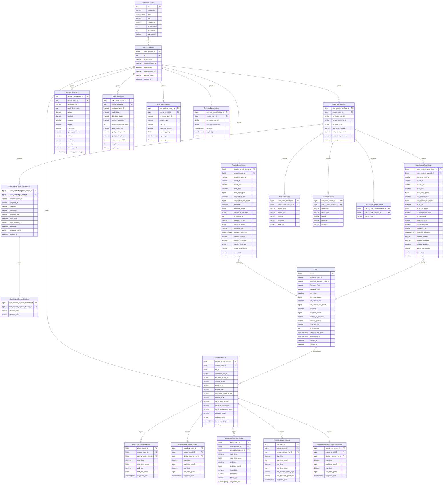
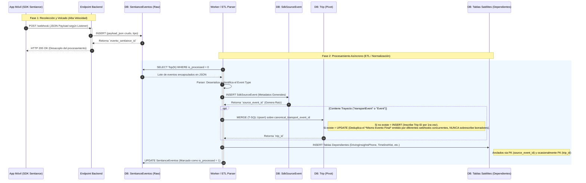

# Diseño de Base de Datos - Eventos Sentiance

> **Versión:** 1.0.0  
> **Última Actualización:** 30 de marzo de 2026  
> **Motor Objetivo:** Microsoft SQL Server (T-SQL)

## 1. Contexto y Origen de Datos (Payloads)

Este modelo de base de datos está diseñado para almacenar estructuradamente la información recolectada por el **SDK de Sentiance** en aplicaciones móviles.

La información ingresa al backend mediante **eventos recibidos a través de los *listeners* del SDK en el dispositivo móvil** (en nuestro caso, bajo la implementación de React Native). 

**Puntos Importantes:**

- **Solo Listeners:** No se consolida información proveniente de los volcados diarios (Offloads). El stream es un pipeline directo donde la app móvil emite el payload JSON directamente al backend.
- **Formato Crudo (Raw):** El JSON almacenado inicialmente en la tabla `SentianceEventos` es el payload exacto emitido por el SDK, sin agregados, sobres ni modificaciones de parte del backend.  Si bien la idea es comprimir el mensaje antes de enviarlo, mi propuesta es guardarlo descompactado y legible por humanos para facilitar el debugging. El presente esquema propuesto permite purgar periódicamente esta tabla de modo que no hay peligro de un crecimiento descontrolado de la necesidad de almacenamiento.
- **Múltiples Fuentes de Viajes (`Trip`):** La entidad central `Trip` (viaje) no proviene de un solo payload. Es una tabla normalizada alimentada por múltiples fuentes: Eventos temporales (`TimelineEvent` o del `UserContext`) especialmente útiles para viajes cortos, peatonales, bicicletas o colectivos, y objetos de `DrivingInsights` para trayectos motorizados de autos/motos.

---

## 2. Diagrama Entidad-Relación (ER)



---

## 3. Diccionario de Datos (Mapeo por Tabla)

> **📍 MOTOR OBJETIVO: Microsoft SQL Server (T-SQL)**  
> Todo el esquema ER y el Diccionario de Datos están pensados estructuralmente para ser implementados en **Microsoft SQL Server**.
> - Campos booleanos lógicos se expresan como `BIT` (`0` / `1`).
> - Objetos anidados en JSON y strings extensos (sin longitud predecible) se tipan como `NVARCHAR(MAX)`. En el caso de los waypoints podría valer la pena guardarolos en algún formato más compacto tipo CBOR ya que es altamente improbable que debamos hacer búsquedas por valores dentro de ese campo.
> - Columnas numéricas usan `NUMERIC`, `DECIMAL` o `BIGINT` en lugar de literales genéricos para garantizar exactitud temporal y espacial.

> A continuación, se detalla campo por campo cada tabla presente en el diagrama, vinculándola con la variable equivalente dictada por la documentación  de Sentiance react-native.

### 3.1. Tablas Base y Gestión

#### 3.1.1. `SentianceEventos`

Tabla originaria donde el backend "aterriza" la recepción del payload de la app móvil (Listener raw).


| Campo          | Tipo          | Mapeo Sentiance                                                                                                                                                              |
| -------------- | ------------- | ---------------------------------------------------------------------------------------------------------------------------------------------------------------------------- |
| `id`           | INT (PK)      | Auto-Generado Interno                                                                                                                                                        |
| `sentianceid`  | VARCHAR       | Identificador del usuario.                                                                                                                                                   |
| `json`         | NVARCHAR(MAX) | **Payload exacto emitido desde la app React Native**.                                                                                                                        |
| `tipo`         | VARCHAR       | Tipo de Listener (Ej. `UserContextUpdate`, `TimelineUpdate`, `DrivingInsightsReady`, `CrashEvent`)                                                                           |
| `created_at`   | DATETIME      | Marca de tiempo asignada por el servidor backend de forma local al instante de recepcionar el webhook HTTP (ej. `GETDATE()`)                                                 |
| `is_processed` | BIT           | Flag nativo de control de este pipeline ETL (Extract -> Transform -> Load): seteado a `1` una vez el JSON fue parseado y distribuido exitosamente a las tablas normalizadas. |
| `procesado`    | BIT           | **⚠️ LEGACY / EXTERNO:** Flag preexistente manipulado por rutinas ajenas a esta integración. No tiene relación alguna con este pipeline documental. **Ignorar**.             |
| `app_version`  | VARCHAR       | Custom Backend (versión de la App si se inyecta en headers HTTP/URL).                                                                                                        |


#### 3.1.2. `SdkSourceEvent`

Auditoría de los registros. Permite referenciar un objeto normalizado a su JSON originario.


| Campo               | Tipo      | Mapeo Interno                                                         |
| ------------------- | --------- | --------------------------------------------------------------------- |
| `source_event_id`   | BIGINT PK | Clave única autogenerada                                              |
| `id`                | INT FK    | Referencia al `id` de `SentianceEventos`                              |
| `record_type`       | VARCHAR   | Denominación del payload extraído (`CrashEvent`, `UserContext`, etc.) |
| `sentiance_user_id` | VARCHAR   | `user_id`                                                             |
| `source_time`       | DATETIME  | Obtenido de los epoch del evento principal en el JSON                 |
| `source_event_ref`  | VARCHAR   | ID de referencia directa (`event.id` o `transportEvent.id`)           |
| `payload_hash`      | VARCHAR   | Hash MD5/SHA para determinar unicidad de JSONs procesados             |
| `created_at`        | DATETIME  | Tiempo Interno de normalización                                       |


**Nota**: tal vez convendría guardar la fecha también en formato legible por 

humanos

### 3.2. Dominio de Módulo Temporal (Timeline Events)

#### 3.2.1. `TimelineEventHistory`

Eventos de línea de tiempo del listener `addTimelineUpdateListener`.  
*Ref SDK: `react-native/event-timeline/timeline/definitions (Event Interface)*`


| Campo                       | Tipo          | Mapeo Sentiance       | JSON Detail                                                                                                    |
| --------------------------- | ------------- | --------------------- | -------------------------------------------------------------------------------------------------------------- |
| `timeline_event_history_id` | BIGINT PK     | N/A                   | PK de tabla                                                                                                    |
| `source_event_id`           | BIGINT FK     | N/A                   | Relación a `SdkSourceEvent`                                                                                    |
| `sentiance_user_id`         | VARCHAR       | N/A                   | ID Sentiance                                                                                                   |
| `event_id`                  | VARCHAR       | `id`                  | Id único del evento temporal. **Nota:** Si `event_type` es *"IN_TRANSPORT"*, este ID coincide exactamente con el `canonical_transport_event_id` de la tabla **`Trip`**. |
| `event_type`                | VARCHAR       | `type`                | Enum estricto: *"UNKNOWN", "STATIONARY", "OFF_THE_GRID", "IN_TRANSPORT"*                                       |
| `start_time`                | DATETIME      | `startTime`           | ISO 8601 string                                                                                                |
| `start_time_epoch`          | BIGINT        | `startTimeEpoch`      | UTC milisegundos                                                                                               |
| `last_update_time`          | DATETIME      | `lastUpdateTime`      | ISO 8601 string                                                                                                |
| `last_update_time_epoch`    | BIGINT        | `lastUpdateTimeEpoch` | UTC milisegundos                                                                                               |
| `end_time`                  | DATETIME      | `endTime`             | ISO 8601 string                                                                                                |
| `end_time_epoch`            | BIGINT        | `endTimeEpoch`        | UTC milisegundos                                                                                               |
| `duration_in_seconds`       | NUMERIC       | `durationInSeconds`   | Nulo si no culminó                                                                                             |
| `is_provisional`            | BIT           | `isProvisional`       | Determina si es `true` (en curso) o `false` (final)                                                            |
| `transport_mode`            | VARCHAR       | `transportMode`       | Enum estricto: *"UNKNOWN", "BICYCLE", "WALKING", "RUNNING", "TRAM", "TRAIN", "CAR", "BUS", "MOTORCYCLE"*       |
| `distance_meters`           | NUMERIC       | `distance`            | Distancia del transporte en metros                                                                             |
| `occupant_role`             | VARCHAR       | `occupantRole`        | *"DRIVER", "PASSENGER", "UNAVAILABLE"*                                                                         |
| `transport_tags_json`       | NVARCHAR(MAX) | `transportTags`       | String JSON del objeto Key-Value asignado.                                                                     |
| `location_latitude`         | DECIMAL       | `location.latitude`   | Presente sólo para `STATIONARY`                                                                                |
| `location_longitude`        | DECIMAL       | `location.longitude`  | Presente sólo para `STATIONARY`                                                                                |
| `location_accuracy`         | NUMERIC       | `location.accuracy`   | Precisión estacionaria (mts)                                                                                   |
| `venue_significance`        | VARCHAR       | `venue.significance`  | Enum estricto: *"UNKNOWN", "HOME", "WORK", "POINT_OF_INTEREST"*                                                |
| `venue_type`                | VARCHAR       | `venue.type`          | Enum extenso con docenas de categorías (incluye *"UNKNOWN"*, *"SHOP_LONG"*, *"OFFICE"*, *"RESIDENTIAL"*, etc.) |


---

### 3.3. Dominio de Contexto de Usuario (User Context)

Derivados del Listener `addUserContextUpdateListener`.  
*Ref SDK: `react-native/user-context/definitions (UserContext)*`

#### 3.3.1. `UserContextHeader`

Contiene la base del objeto superior `UserContextUpdate`.


| Campo                     | Tipo      | Mapeo Sentiance               | Detalles                                   |
| ------------------------- | --------- | ----------------------------- | ------------------------------------------ |
| `user_context_payload_id` | BIGINT PK | N/A                           | PK Interno                                 |
| `source_event_id`         | BIGINT FK | N/A                           | PK SdkSourceEvent                          |
| `sentiance_user_id`       | VARCHAR   | N/A                           | ID Sentiance                               |
| `context_source_type`     | VARCHAR   | N/A                           | Ejemplo: `USER_CONTEXT_LISTENER`           |
| `semantic_time`           | VARCHAR   | `userContext.semanticTime`    | *"MORNING", "LATE_MORNING", "NIGHT"*, etc. |
| `last_known_latitude`     | DECIMAL   | `lastKnownLocation.latitude`  | Coordenada Y                               |
| `last_known_longitude`    | DECIMAL   | `lastKnownLocation.longitude` | Coordenada X                               |
| `last_known_accuracy`     | NUMERIC   | `lastKnownLocation.accuracy`  | Precisión                                  |


#### 3.3.2. `UserContextUpdateCriteria`

Los motivos de actualización extraídos del arreglo `criteria[]`.


| Campo                             | Tipo      | Mapeo Sentiance                                                                     |
| --------------------------------- | --------- | ----------------------------------------------------------------------------------- |
| `user_context_update_criteria_id` | BIGINT PK | Auto                                                                                |
| `user_context_payload_id`         | BIGINT FK | FK Padre                                                                            |
| `criteria_code`                   | VARCHAR   | Elementos en `criteria`: *"CURRENT_EVENT"*, *"ACTIVE_SEGMENTS"*, *"VISITED_VENUES"* |


#### 3.3.3. `UserContextEventDetail`

Itera los eventos activos `events[]` actuales del contexto.  
Mapeo idéntico a `TimelineEventHistory` porque ambos usan el modelo `Event` (contiene `transportMode`, `occupantRole`, locations y demás). Única diferencia: Clave Foránea a `UserContextHeader`.

> **⚠️ Nota de Normalización y Almacenamiento:** Aunque el objeto nativo extraído `events[]` contiene un voluminoso array de `waypoints` (coordenadas en milisegundos del trayecto), este campo fue **omitido intencionalmente** del esquema `UserContextEventDetail`. Para evitar duplicidad extrema de Megabytes en JSON, dichos recorridos se almacenan de manera única en la tabla pivote `**Trip**`.

#### 3.3.4. `UserContextActiveSegmentDetail`

Desgloce de la lista `activeSegments[]` del usuario (Comportamientos/Segmentos inferidos).


| Campo                             | Tipo              | Mapeo Sentiance                                       |
| --------------------------------- | ----------------- | ----------------------------------------------------- |
| `user_context_segment_history_id` | BIGINT PK         | ID Interno                                            |
| `user_context_payload_id`         | BIGINT FK         | FK Padre                                              |
| `sentiance_user_id`               | VARCHAR           | ID Sentiance                                          |
| `segment_id`                      | VARCHAR           | `id` (Identificador del Segmento)                     |
| `category`                        | VARCHAR           | `category` (*"LEISURE", "MOBILITY", "WORK_LIFE"*)     |
| `subcategory`                     | VARCHAR           | `subcategory` (*"SHOPPING", "SOCIAL", "TRANSPORT"*)   |
| `segment_type`                    | VARCHAR           | `type` (*"CITY_WORKER", "EARLY_BIRD", "RESTO_LOVER"*) |
| `start_time` / `start_time_epoch` | DATETIME / BIGINT | `startTime` / `startTimeEpoch`                        |
| `end_time` / `end_time_epoch`     | DATETIME / BIGINT | `endTime` / `endTimeEpoch`                            |


#### 3.3.5. `UserContextSegmentAttribute`

Iterado mediante objeto secundario `attributes[]` hijo del arreglo `activeSegments[]`.


| Campo             | Tipo    | Mapeo Sentiance                    |
| ----------------- | ------- | ---------------------------------- |
| `attribute_name`  | VARCHAR | `name` (Nombre del atributo en BD) |
| `attribute_value` | NUMERIC | `value` (Valor del atributo)       |


#### 3.3.6. `UserHomeHistory` y `UserWorkHistory`

Lugares frecuentes estables `home` y `work` del `UserContext`.


| Campo                               | Tipo      | Mapeo Sentiance                     |
| ----------------------------------- | --------- | ----------------------------------- |
| `user_home_history_id` (o work)     | BIGINT PK | -                                   |
| `significance`                      | VARCHAR   | `significance` ("HOME" / "WORK")    |
| `venue_type`                        | VARCHAR   | `type` ("RESIDENTIAL", "OFFICE"...) |
| `latitude`, `longitude`, `accuracy` | DECIMAL   | En iterado `location` del venue     |


---

### 3.4. Dominio de Hábitos Conductuales de Manejo (Driving Insights)

Vienen del listener `addDrivingInsightsReadyListener`, gatillado en transportes finalizados. Deben incluir a través de la app todas las llamadas auxiliares (`getHarshDrivingEvents`, `getCallWhileMovingEvents` etc.) encoladas en el JSON enviado al backend.  
*Ref SDK: `react-native/driving-insights/definitions*`

#### 3.4.1. `DrivingInsightsTrip`

Mapeo principal de `DrivingInsights` (contiene `transportEvent` y `safetyScores`).

> **⚠️ Nota de Normalización (Omisión de Waypoints):** A pesar de que el objeto nativo extraído `transportEvent` contiene en sus entrañas un array pesado de `waypoints` (tracking geoespacial a milisegundos), esta propiedad fue **purgada intencionalmente** del mapeo DDL de `DrivingInsightsTrip`. Para eficientizar el almacenamiento y evitar gigabytes de coordenadas duplicadas, el guardado de `waypoints_json` de todos los viajes se delega de forma exclusiva y consolidada a la tabla canónica central `**Trip**`.


| Campo                      | Tipo          | Mapeo Sentiance                       | Notas                                                     |
| -------------------------- | ------------- | ------------------------------------- | --------------------------------------------------------- |
| `driving_insights_trip_id` | BIGINT PK     | -                                     | -                                                         |
| `source_event_id`          | BIGINT FK     | -                                     | -                                                         |
| `trip_id`                  | BIGINT FK     | -                                     | FK de la tabla canon `Trip`                               |
| `sentiance_user_id`        | VARCHAR       | -                                     | Obtenido de JWT                                           |
| `transport_event_id`       | VARCHAR       | `transportEvent.id`                   | La ID original de Trip del Timeline / Contexto            |
| `smooth_score`             | NUMERIC       | `safetyScores.smoothScore`            | (0 a 1)                                                   |
| `focus_score`              | NUMERIC       | `safetyScores.focusScore`             | (0 a 1)                                                   |
| `legal_score`              | NUMERIC       | `safetyScores.legalScore`             | (0 a 1)                                                   |
| `call_while_moving_score`  | NUMERIC       | `safetyScores.callWhileMovingScore`   | (0 a 1)                                                   |
| `overall_score`            | NUMERIC       | `safetyScores.overallScore`           | (0 a 1)                                                   |
| `harsh_braking_score`      | NUMERIC       | `safetyScores.harshBrakingScore`      | (0 a 1)                                                   |
| `harsh_turning_score`      | NUMERIC       | `safetyScores.harshTurningScore`      | (0 a 1)                                                   |
| `harsh_acceleration_score` | NUMERIC       | `safetyScores.harshAccelerationScore` | (0 a 1)                                                   |
| `distance_meters`          | NUMERIC       | `transportEvent.distance`             | Distancia extraída en metros                              |
| `occupant_role`            | VARCHAR       | `transportEvent.occupantRole`         | Enum estricto: *"DRIVER"*, *"PASSENGER"*, *"UNAVAILABLE"* |
| `transport_tags_json`      | NVARCHAR(MAX) | `transportEvent.transportTags`        | Serializado dict key-value                                |


#### 3.4.2. `DrivingInsightsHarshEvent`

Deriva de `getHarshDrivingEvents()`.


| Campo                  | Tipo            | Mapeo Sentiance (`HarshDrivingEvent[]`)      |
| ---------------------- | --------------- | -------------------------------------------- |
| `start_time` / `epoch` | DATETIME/BIGINT | `startTime` / `startTimeEpoch`               |
| `end_time` / `epoch`   | DATETIME/BIGINT | `endTime` / `endTimeEpoch`                   |
| `magnitude`            | NUMERIC         | `magnitude`                                  |
| `confidence`           | NUMERIC         | `confidence`                                 |
| `harsh_type`           | VARCHAR         | `type` (*"ACCELERATION", "BRAKING", "TURN"*) |
| `waypoints_json`       | NVARCHAR(MAX)   | `waypoints[]` stringificado                  |


#### 3.4.3. `DrivingInsightsCallEvent`

Deriva de llamadas auxiliares a `getPhoneUsageEvents()` y `getCallWhileMovingEvents()`.

> **💡 Nota de Nomenclatura (Frontend vs Backend):** Oficialmente, en el contrato y documentación TypeScript de Sentiance, los objetos de llamadas mientras se maneja están empaquetados bajo la interfaz `CallWhileMovingEvent`. En esta Base de Datos se denominó explícitamente a la tabla como `**DrivingInsightsCallEvent**` por mera consistencia de diseño para estandarizar todos los "insights" vehiculares. Por lo tanto: `**CallWhileMovingEvent` ≡ `DrivingInsightsCallEvent**`.


| Campo                     | Tipo            | Mapeo Sentiance                | Objeto Origen              |
| ------------------------- | --------------- | ------------------------------ | -------------------------- |
| `start_time` / `epoch`    | DATETIME/BIGINT | `startTime` / `startTimeEpoch` | En ambos                   |
| `end_time` / `epoch`      | DATETIME/BIGINT | `endTime` / `endTimeEpoch`     | En ambos                   |
| `min_travelled_speed_mps` | NUMERIC         | `minTravelledSpeedInMps`       | Exclusivo de **CallEvent** |
| `max_travelled_speed_mps` | NUMERIC         | `maxTravelledSpeedInMps`       | Exclusivo de **CallEvent** |
| `waypoints_json`          | NVARCHAR(MAX)   | `waypoints[]` stringificado    | En ambos                   |


#### 3.4.4. `DrivingInsightsSpeedingEvent` / `DrivingInsightsWrongWayDrivingEvent`

Análogos derivados de `getSpeedingEvents()` y `getWrongWayDrivingEvents()`.  
Mapeo idéntico de base (`startTime`, `endTime`, `waypoints`).

---

### 3.5. Excepciones Vehiculares y Estado

#### 3.5.1. `VehicleCrashEvent`

Provisto a través de `addVehicleCrashEventListener`.  
*Ref SDK: `react-native/crash-detection/definitions*`


| Campo                                           | Tipo          | Mapeo Sentiance (`CrashEvent`)                                                  |
| ----------------------------------------------- | ------------- | ------------------------------------------------------------------------------- |
| `vehicle_crash_event_id`                        | BIGINT PK     | -                                                                               |
| `crash_time_epoch`                              | BIGINT        | `time`                                                                          |
| `latitude`, `longitude`, `accuracy`, `altitude` | DECIMAL       | Mapeado individual desde el objeto interno `location` al registrarse el impacto |
| `magnitude`                                     | NUMERIC       | `magnitude`                                                                     |
| `speed_at_impact`                               | NUMERIC       | `speedAtImpact`                                                                 |
| `delta_v`                                       | NUMERIC       | `deltaV` (cambio de velocidad en km/h o mph)                                    |
| `confidence`                                    | NUMERIC       | `confidence`                                                                    |
| `severity`                                      | VARCHAR       | `severity` (*"LOW", "MEDIUM", "HIGH"*)                                          |
| `detector_mode`                                 | VARCHAR       | `detectorMode` (*"CAR", "TWO_WHEELER"*)                                         |
| `preceding_locations_json`                      | NVARCHAR(MAX) | Stringificado del JSON Array `precedingLocations`                               |


#### 3.5.2. `SdkStatusHistory`

Estado general de recolección en los dispositivos a través del listener de status updates. Mapeado desde el payload nativo `SdkStatus`.

> **⚠️ Nota de Captura Parcial (Muestreo Intencional):** La interfaz original TypeScript `SdkStatus` expone numeramente docenas de propiedades y banderas técnicas (tales como `userExists`, `backgroundRefreshStatus`, `isRemoteEnabled`, `isBatteryOptimizationEnabled`, `isAirplaneModeEnabled`, etc.). El modelo de base de datos optó por registrar de forma controlada estrictamente un subset de sus atributos, priorizando aquellos vinculados al cuote de tracking y localización ("is_location_available", "location_permission", etc., que componen la tabla relacional) para así mitigar la saturación de ruido técnico y maximizar el rendimiento DB. Por ende, la abstracción tabular en `SdkStatusHistory` se trata de un filtrado parcial e intencional, y no de un Mapeo Estructural 1:1 directo de todos los flag del SDK Status original.


| Campo                      | Tipo      | Mapeo Sentiance y Detalles                                                |
| -------------------------- | --------- | ------------------------------------------------------------------------- |
| `sdk_status_history_id`    | BIGINT PK | Identificador único autoincremental de la tabla.                          |
| `source_event_id`          | BIGINT FK | FK referenciando a la tabla maestra `SdkSourceEvent`.                     |
| `sentiance_user_id`        | VARCHAR   | Identificador del usuario emisor del evento.                              |
| `captured_at`              | DATETIME  | Instante de captura local / persistencia del status.                      |
| `start_status`             | VARCHAR   | Extraído de `startStatus` (Estado general del arranque).                  |
| `detection_status`         | VARCHAR   | Extraído de `detectionStatus` (Porción operativa del SDK).                |
| `location_permission`      | VARCHAR   | Extraído de `locationPermission` (Si los permisos OS están garantizados). |
| `precise_location_granted` | BIT       | Extraído de `isPreciseLocationAuthorizationGranted`.                      |
| `quota_status_wifi`        | VARCHAR   | Extraído de `wifiQuotaStatus`.                                            |
| `quota_status_mobile`      | VARCHAR   | Extraído de `mobileQuotaStatus`.                                          |
| `quota_status_disk`        | VARCHAR   | Extraído de `diskQuotaStatus`.                                            |
| `is_location_available`    | BIT       | Extraído de `isLocationAvailable`.                                        |
| `can_detect`               | BIT       | Extraído de `canDetect`.                                                  |


#### 3.5.3. `UserActivityHistory`

Recopilación de contextos gruesos emitidos por el listener de User Activity. Mapeado del payload nativo `UserActivity`.


| Campo                               | Tipo          | Mapeo Sentiance y Lógica                                                                                                                                                                                                                            |
| ----------------------------------- | ------------- | --------------------------------------------------------------------------------------------------------------------------------------------------------------------------------------------------------------------------------------------------- |
| `user_activity_history_id`          | BIGINT PK     | Identificador único autoincremental de la tabla.                                                                                                                                                                                                    |
| `source_event_id`                   | BIGINT FK     | FK referenciando a la tabla maestra `SdkSourceEvent`.                                                                                                                                                                                               |
| `sentiance_user_id`                 | VARCHAR       | Identificador del usuario emisor de la actividad.                                                                                                                                                                                                   |
| `captured_at`                       | DATETIME      | Instante de persistencia de la actividad.                                                                                                                                                                                                           |
| `activity_type`                     | VARCHAR       | Extraído de `type` (Ej. *"USER_ACTIVITY_TYPE_TRIP"*, *"USER_ACTIVITY_TYPE_STATIONARY"*).                                                                                                                                                            |
| `trip_type`                         | VARCHAR       | Extraído de `tripInfo.type`. Solo presente si la actividad principal es viaje.                                                                                                                                                                      |
| `stationary_latitude` / `longitude` | DECIMAL       | Extraído de `stationaryInfo.location.latitude`/`longitude`. **⚠️ Permite NULL:** Incluso si la actividad es "STATIONARY", la interfaz nativa los expone como opcionales (`?`); pueden llegar sin coordenadas si el celular pierde señal de red/GPS. |
| `payload_json`                      | NVARCHAR(MAX) | Copia raw del JSON emitido por si varía en actualizaciones futuras.                                                                                                                                                                                 |


#### 3.5.4. `TechnicalEventHistory`

Logueo de advertencias o errores nativos del SDK, para debugging en servidor sin depender del volcado Offload (Payload sujeto a implementación de logger).

---

### 3.6. Tabla Integrada / Pivot ("Canon")

#### 3.6.1. `Trip`

**Importantísimo**: No es directamente poblada por un listener JSON Sentiance unitario, sino un integrador de viajes (Transports).


| Campo                          | Tipo              | Mapeo Sentiance y Lógica de Construcción                                                                                                                                                                                                                                                                                                                                                                                                                                                                   |
| ------------------------------ | ----------------- | ---------------------------------------------------------------------------------------------------------------------------------------------------------------------------------------------------------------------------------------------------------------------------------------------------------------------------------------------------------------------------------------------------------------------------------------------------------------------------------------------------------- |
| `trip_id`                      | BIGINT PK         | ID autoincremental de la base de datos (Primary Key Interna).                                                                                                                                                                                                                                                                                                                                                                                                                                              |
| `canonical_transport_event_id` | VARCHAR UNIQUE    | **¿De dónde sale?** Se extrae textualmente de `transportEvent.id` (DrivingInsights) o de `event.id` (Timeline). **Lógica de Consolidación (Upsert):** Requiere imperativamente un **UNIQUE CONSTRAINT** u **UNIQUE INDEX** activo en la base de datos sobre este campo. Esto es fundamental para habilitar instrucciones anti-duplicados como `MERGE` en T-SQL de manera atómica transaccional y evitar colisiones cuando múltiples webhooks/listeners insertan datos simultáneamente para el mismo viaje. |
| `first_seen_from`              | VARCHAR           | *"TIMELINE"*, *"USER_CONTEXT"*, o *"DRIVING_INSIGHTS"* (Indica qué listener reportó el viaje primero y causó el INSERT original).                                                                                                                                                                                                                                                                                                                                                                          |
| `transport_mode`               | VARCHAR           | Extraído de `transportMode` (Enum estricto: *"UNKNOWN", "BICYCLE", "WALKING", "RUNNING", "TRAM", "TRAIN", "CAR", "BUS", "MOTORCYCLE"*).                                                                                                                                                                                                                                                                                                                                                                    |
| `start_time` / `epoch`         | DATETIME / BIGINT | Extraído de `startTime` / `startTimeEpoch`.                                                                                                                                                                                                                                                                                                                                                                                                                                                                |
| `end_time` / `epoch`           | DATETIME / BIGINT | Extraído de `endTime` / `endTimeEpoch` al cerrarse el viaje.                                                                                                                                                                                                                                                                                                                                                                                                                                               |
| `duration_in_seconds`          | NUMERIC           | Extraído de `durationInSeconds`                                                                                                                                                                                                                                                                                                                                                                                                                                                                            |
| `distance_meters`              | NUMERIC           | Extraído de `distance`                                                                                                                                                                                                                                                                                                                                                                                                                                                                                     |
| `occupant_role`                | VARCHAR           | Extraído de `occupantRole` (Enum estricto: *"DRIVER"*, *"PASSENGER"*, *"UNAVAILABLE"*). Fundamental para inferir autoría de faltas en "DrivingInsights".                                                                                                                                                                                                                                                                                                                                                   |
| `is_provisional`               | BIT               | Mapeado desde `isProvisional`. **Vital**: Los eventos finales y provisionales usan IDs (`canonical_transport_event_id`) completamente distintos que nunca se pisan.                                                                                                                                                                                                                                                                                                                                        |
| `transport_tags_json`          | NVARCHAR(MAX)     | Recuperado del objeto libre `transportTags`.                                                                                                                                                                                                                                                                                                                                                                                                                                                               |
| `waypoints_json`               | NVARCHAR(MAX)     | Extraído del array de objetos `waypoints[]` y guardado como texto.                                                                                                                                                                                                                                                                                                                                                                                                                                         |


> **IMPORTANTE: Cómo trata el backend a los eventos provisionales y finales (`isProvisional`)**:  
> Según la documentación de Sentiance, los eventos provisionales generados en tiempo real **se generan independientemente a los finales y NO tienen el mismo ID**. 
> - A medida que el usuario se mueve, el SDK genera eventos provisorios en tiempo real (ej: "En movimiento IN_TRANSPORT") donde `isProvisional` es `true`. Estos se iteran e insertan en la tabla `Trip` como historias/segmentos. 
> - Una vez que el usuario se vuelve a quedar estacionario, Sentiance consolida todo el movimiento previo, procesa los scores y emite los eventos **Finales** (`isProvisional = false`). Los eventos finales tienen **IDs completamente nuevos** y Sentiance no provee links/claves foráneas apuntando a sus eventos "borrador" preliminares.
> - *↳ **Resultado en Base de Datos**: El backend **no actualiza ni reemplaza (UPDATE)** los records provisionales. Simplemente ingresa la nueva fila definitiva enviada por el evento final. Para análisis de scores de viaje limpio, reporting, o consumo en la UI usuaria final, la base de datos se debe filtrar buscando excluyentemente `WHERE is_provisional = 0` para aislar el output definitivo del viaje, descartando los borradores en tiempo real.*

> [!NOTE]
> **Nota Técnica de Implementación: Deduplicación vs Desvinculación de Viajes**  
> Es imperativo para el equipo de Backend (ETL) distinguir mecánicamente entre dos flujos totalmente diferentes al procesar identificadores (`canonical_transport_event_id`):
> 1. **Deduplicación de Evento Final (Uso de UPDATE / MERGE):** Cuando un "Viaje Final" concluye, múltiples módulos nativos de Sentiance (`UserContext`, `DrivingInsights`, `Timeline`) se disparan concurrentemente hacia la nube. Todos emiten de manera redundante el **mismo ID de viaje Final**. El backend debe usar `MERGE` en T-SQL para que el webhook que llegue primero realice el `INSERT` original, y los webhooks subsecuentes (que traen el mismo ID) realicen un `UPDATE`, enriqueciendo la fila única (ej. anexándole `waypoints` y Safety Scores).
> 2. **Desvinculación absoluta del Provisorio (Uso exclusivo de INSERT):** Los eventos en vivo emitidos en tiempo real (donde `isProvisional = true`) usan un ID propio que **no guarda relación alguna u originaria** con el ID del evento Final. El `MERGE` del webhook final nunca va a "coincidir" ni pisar al borrador. Cada evento provisorio que expulse la App simplemente realiza un `INSERT` pasivo (se acumulan muertos), y cuando se despacha el Viaje Final definitivo meses o minutos después, se somete a un `INSERT` independiente en otra fila con un GUID completamente nuevo.

---

## 3.7. Índices de Base de Datos Recomendados (Alto Volumen)

Debido a que una plataforma telemática conectada a múltiples dispositivos móviles (especialmente si recopila datos a baja latencia en ~1Hz o al detectar movimiento) genera cientos de miles o millones de filas rápidamente, la definición del DDL debe incluir índices **B-Tree** precisos para no deteriorar los tiempos de las consultas del negocio.

Por el diseño establecido, recomendamos enfáticamente crear los siguientes índices sobre las tablas de alto impacto (`SentianceEventos`, `TimelineEventHistory`, `UserActivityHistory` y `Trip`):

1. **Índice sobre `sentiance_user_id**` (Alta Cardinalidad):
  Casi cualquier pantalla principal del sistema (ej: "Consultar viajes del usuario X") o el filtrado por conductor usa esta columna. Al crear un index (ej: `idx_user_context_sentiance_user_id`) se evitan búsquedas Full-Table Scan que demorarían minutos.
2. **Índice sobre Timestamp (`start_time`, `start_time_epoch` o `captured_at`)** (Rangos Continuos):
  Crítico para análisis de flotas ("Viajes creados este mes") o para depuración de payloads antiguos. La combinación de un índice compuesto multicolumna `(sentiance_user_id, start_time_epoch)` cubrirá el 99% de las consultas analíticas del Dashboard.
3. **Índice Filtrado por `is_provisional`:**
  Tablas como `Trip` o `TimelineEventHistory` frecuentemente serán consultadas bajo la estricta premisa `WHERE is_provisional = 0`. Generar un índice condicional (particularmente un *Filtered Index* en SQL Server: `CREATE INDEX idx_final_trips ON Trip (trip_id) WHERE is_provisional = 0`) hará que listar la billetera de viajes finalizados sea instantáneo sin escanear el remanente inútil temporal.
4. **Índices en Claves Foráneas (`trip_id`, `source_event_id`)**:
  Siempre construir explícitamente índices sobre las FK `trip_id` en las subtablas dependientes (como `DrivingInsightsPhoneEvent` o `DrivingInsightsTrip`). Si se requiere investigar frenadas bruscas durante un bloque de viaje particular, la Join entre `Trip` y la tabla satélite dependerá de que el motor SQL encuentre rápidamente dicha sub-lista de FKs.
5. **Índice Único Transaccional (UNIQUE CONSTRAINT)**:
  En la tabla colaborativa maestra `Trip`, es **fundamental** indexar `canonical_transport_event_id` bajo una restricción única (`UNIQUE INDEX / CONSTRAINT`). Sin ella, el mecanismo atómico de `UPSERT` ("si existe hago update, sino insert") no es viable y generará carreras críticas.

---

## 4. Anexo: Estructuras JSON Esperadas (Payloads SDK Principales)

Según la documentación oficial de Sentiance (React Native), las estructuras de los objetos clave emitidos por los listeners hacia el backend siguen la forma descrita a continuación. Esto es material de referencia para que el equipo backend sepa cómo extraer o deserializar cada propiedad.

### 4.1. Payload Listener: Timeline (`Event`)

*Estructura base usada tanto en el Timeline como en el detalle de eventos del User Context.*

```json
{
  "id": "e_xxxxxxxxxxx",
  "startTime": "2023-10-25T08:30:00.000Z",
  "startTimeEpoch": 1698222600000,
  "lastUpdateTime": "2023-10-25T08:45:00.000Z",
  "lastUpdateTimeEpoch": 1698223500000,
  "endTime": "2023-10-25T08:50:00.000Z",
  "endTimeEpoch": 1698223800000,
  "durationInSeconds": 1200,
  "type": "IN_TRANSPORT",
  "isProvisional": false,
  
  "transportMode": "CAR",
  "distance": 8500,
  "occupantRole": "DRIVER",
  "transportTags": {
     "my_custom_tag": "value"
  },
  
  "location": {
    "latitude": -34.603722,
    "longitude": -58.381592,
    "accuracy": 15
  },
  
  "venue": {
    "location": {
       "latitude": -34.603722,
       "longitude": -58.381592,
       "accuracy": 15
    },
    "significance": "WORK",
    "type": "OFFICE"
  },
  
  "waypoints": [
    {
      "latitude": -34.603722,
      "longitude": -58.381592,
      "accuracy": 10,
      "timestamp": 1698222605000,
      "speedInMps": 12.5,
      "speedLimitInMps": 16.66,
      "isSpeedLimitInfoSet": true,
      "hasUnlimitedSpeedLimit": false,
      "isSynthetic": true
    }
  ]
}
```

*(Nota: `location` y `venue` están típicamente presentes si `type == "STATIONARY"`, mientras que `waypoints`, `distance`, `occupantRole` y `transportMode` están si es `"IN_TRANSPORT"`).*

### 4.2. Payload Listener: User Context (`UserContext`)

```json
{
  "criteria": [
    "CURRENT_EVENT",
    "ACTIVE_SEGMENTS"
  ],
  "events": [
    { /* Array de objetos tipados como Timeline Event (Ver 4.1) */ }
  ],
  "activeSegments": [
    {
      "category": "WORK_LIFE",
      "subcategory": "WORK",
      "type": "CITY_WORKER",
      "id": "s_cityworker1",
      "startTime": "2023-10-01T00:00:00.000Z",
      "startTimeEpoch": 1696118400000,
      "endTime": null,
      "endTimeEpoch": null,
      "attributes": [
        {
          "name": "COMMUTE_DISTANCE",
          "value": 15.5
        }
      ]
    }
  ],
  "lastKnownLocation": {
    "latitude": -34.603722,
    "longitude": -58.381592,
    "accuracy": 20.5
  },
  "home": {
    "location": { "latitude": -34.5, "longitude": -58.4, "accuracy": 50 },
    "significance": "HOME",
    "type": "RESIDENTIAL"
  },
  "work": {
    "location": { "latitude": -34.6, "longitude": -58.3, "accuracy": 30 },
    "significance": "WORK",
    "type": "OFFICE"
  },
  "semanticTime": "MORNING"
}
```

### 4.3. Payload Listener: Driving Insights (`DrivingInsights`)

*Recibido cuando termina de procesarse por completo un viaje motorizado.*

```json
{
  "transportEvent": {
      /* Estructura Idéntica a Event 4.1 con type: IN_TRANSPORT */
      "id": "e_transport_123",
      "distance": 12500,
      "waypoints": [ ... ]
  },
  "safetyScores": {
    "smoothScore": 0.85,
    "focusScore": 0.90,
    "legalScore": 1.0,
    "callWhileMovingScore": 1.0,
    "overallScore": 0.89,
    "harshBrakingScore": 0.80,
    "harshTurningScore": 0.95,
    "harshAccelerationScore": 0.85
  }
}
```

### 4.4. Payloads Independientes: Sub-Eventos de Manejo (Harsh Events, Phone Events, etc.)

> **Nota importante:** La aplicación Front-End envía de forma **independiente** al backend los reportes de eventos derivados (no van empaquetados obligatoriamente dentro del objeto general de `DrivingInsights`). Cuando el backend reciba el JSON correspondiente a las llamadas de `getHarshDrivingEvents()`, `getPhoneUsageEvents()` o afines, percibirá un Array de objetos con el formato pertinente:

**Ejemplo de Payload JSON para Harsh Events (`HarshDrivingEvent[]`):**

```json
[
  {
    "startTime": "2023-10-25T08:35:00.000Z",
    "startTimeEpoch": 1698222900000,
    "endTime": "2023-10-25T08:35:03.000Z",
    "endTimeEpoch": 1698222903000,
    "magnitude": 4.5,
    "confidence": 0.98,
    "type": "BRAKING",
    "waypoints": [ { "latitude": -34.6, "longitude": -58.4, "timestamp": 1698222901000 } ]
  }
]
```

**Ejemplo de Payload JSON para Eventos Telefónicos (`CallEvent[]`):**

```json
[
  {
    "startTime": "2023-10-25T08:40:00.000Z",
    "startTimeEpoch": 1698223200000,
    "endTime": "2023-10-25T08:42:00.000Z",
    "endTimeEpoch": 1698223320000,
    "minTravelledSpeedInMps": 10.5,
    "maxTravelledSpeedInMps": 22.3,
    "waypoints": [ ... ]
  }
]
```

### 4.5. Payload Listener: Crash Detection (`CrashEvent`)

```json
{
  "time": 1698224000000,
  "location": {
    "latitude": -34.611111,
    "longitude": -58.377777,
    "accuracy": 5,
    "altitude": 14.5
  },
  "precedingLocations": [
    { /* Array de GeoLocation previos al choque */ }
  ],
  "magnitude": 8.5,
  "speedAtImpact": 45.5,
  "deltaV": 18.2,
  "confidence": 0.95,
  "severity": "HIGH",
  "detectorMode": "CAR"
}
```

### 4.6. Anexo de Definiciones TypeScript (Referencia SDK React Native)

A continuación se adjuntan, a modo de complemento, las interfaces oficiales y nativas en *TypeScript* que documenta el módulo `@sentiance-react-native/driving-insights`. Este es el contrato real de datos con el que contarán los programadores del Front-End para generar el JSON Final:

```typescript
export interface DrivingInsights {  
  transportEvent: TransportEvent;
  safetyScores: SafetyScores;
}

export interface SafetyScores {  
  smoothScore?: number;
  focusScore?: number;
  legalScore?: number;
  callWhileMovingScore?: number;
  overallScore?: number;
  harshBrakingScore?: number;
  harshTurningScore?: number;
  harshAccelerationScore?: number;
}

export interface DrivingEvent {  
  startTime: string;  
  startTimeEpoch: number; // in milliseconds  
  endTime: string;  
  endTimeEpoch: number; // in milliseconds  
  waypoints: Waypoint[];  
}

export type HarshDrivingEventType = "ACCELERATION" | "BRAKING" | "TURN";

export interface HarshDrivingEvent extends DrivingEvent {  
  magnitude: number;  
  confidence: number;  
  type: HarshDrivingEventType;  
}

export interface PhoneUsageEvent extends DrivingEvent {}

export interface CallWhileMovingEvent extends DrivingEvent {  
  maxTravelledSpeedInMps?: number;  
  minTravelledSpeedInMps?: number;  
}

export interface SpeedingEvent extends DrivingEvent {}

// Hereda todos los campos de DrivingEvent sin agregar propiedades estructurales adicionales
export interface WrongWayDrivingEvent extends DrivingEvent {}

export interface TransportEvent {  
  id: string;  
  startTime: string;  
  startTimeEpoch: number; // in milliseconds  
  lastUpdateTime: string;  
  lastUpdateTimeEpoch: number; // in milliseconds  
  endTime: string | null;  
  endTimeEpoch: number | null; // in milliseconds  
  durationInSeconds: number | null;  
  type: string;  
  transportMode: TransportMode | null;  
  waypoints: Waypoint[];  
  distance?: number; // in meters  
  transportTags: TransportTags;  
  occupantRole: OccupantRole;  
  isProvisional: boolean;  
}

export type TransportTags = { [key: string]: string };
export type TransportMode = "UNKNOWN" | "BICYCLE" | "WALKING" | "RUNNING" | "TRAM" | "TRAIN" | "CAR" | "BUS" | "MOTORCYCLE";
export type OccupantRole = "DRIVER" | "PASSENGER" | "UNAVAILABLE";

export interface Waypoint {  
  latitude: number;  
  longitude: number;  
  accuracy: number;   // in meters  
  timestamp: number;  // UTC epoch time in milliseconds  
  speedInMps?: number;  // in meters per second  
  speedLimitInMps?: number;  // in meters per second  
  hasUnlimitedSpeedLimit: boolean;  
  isSpeedLimitInfoSet: boolean;  
  isSynthetic: boolean;  
}

export interface SdkStatus {
  startStatus: string;
  detectionStatus: string;
  canDetect: boolean;
  isRemoteEnabled: boolean;
  isAccelPresent: boolean;
  isGyroPresent: boolean;
  isGpsPresent: boolean;
  wifiQuotaStatus: string;
  mobileQuotaStatus: string;
  diskQuotaStatus: string;
  locationPermission: string;
  userExists: boolean;
  isBatterySavingEnabled?: boolean;
  isActivityRecognitionPermGranted?: boolean;
  isPreciseLocationAuthorizationGranted: boolean;
  isBgAccessPermGranted?: boolean; // iOS only
  locationSetting?: string; // Android only
  isAirplaneModeEnabled?: boolean; // Android only
  isLocationAvailable?: boolean;
  isGooglePlayServicesMissing?: boolean; // Android only
  isBatteryOptimizationEnabled?: boolean; // Android only
  isBackgroundProcessingRestricted?: boolean; // Android only
  isSchedulingExactAlarmsPermitted?: boolean; // Android only
  backgroundRefreshStatus: string; // iOS only
}

export interface Location {
  timestamp?: number; // marked optional to maintain compatibility, but is always present
  latitude: number;
  longitude: number;
  accuracy?: number;
  altitude?: number;
  provider?: string; // Android only
}

export interface StationaryInfo {
  location?: Location;
}

export interface TripInfo {
  type: "TRIP_TYPE_SDK" | "TRIP_TYPE_EXTERNAL" | "TRIP_TYPE_UNRECOGNIZED" | "ANY";
}

export interface UserActivity {
  type: "USER_ACTIVITY_TYPE_TRIP" | "USER_ACTIVITY_TYPE_STATIONARY" | "USER_ACTIVITY_TYPE_UNKNOWN" | "USER_ACTIVITY_TYPE_UNRECOGNIZED";
  tripInfo?: TripInfo;
  stationaryInfo?: StationaryInfo;
}
```

---

## 5. Anexo II: Flujo de Datos y Consolidación (Sequence Diagram)

El siguiente diagrama de secuencia ilustra de forma arquitectónica y cronológica cómo fluyen y se procesan los payloads emitidos por el SDK de Sentiance, desde su concepción por el lado móvil hasta su estructuración atómica normalizada final en el esquema de base de datos relacional previamente delineado.

