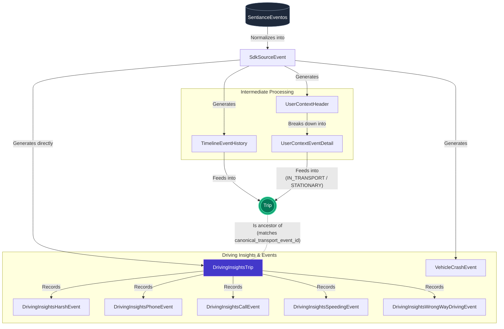

# Trip Data Flow Architecture

The following Mermaid flowchart illustrates how the raw event data "travels" and is processed from the entry point (`SentianceEventos`) down into the canonical `Trip` and its related insight tables, according to the `Entregable.md` documentation.

## Data Flow Explanation

1. **Ingestion & Normalization**
    *   All data lands as raw JSON in the `SentianceEventos` table.
    *   It is then processed and normalized into the `SdkSourceEvent` table.

2. **Splitting the Data**
    *   From `SdkSourceEvent`, the data branches out into specific domain tables:
        *   **Timeline events:** Go to `TimelineEventHistory`.
        *   **User Context events:** The full payload goes to `UserContextHeader`, and the inner events array is broken out into `UserContextEventDetail`.
        *   **Vehicle Crashes:** Are stored directly into `VehicleCrashEvent`.
        *   **Completed trip scores:** Land safely in `DrivingInsightsTrip`.

3. **Consolidating the Trip**
    *   Both `TimelineEventHistory` and `UserContextEventDetail` feed into the canonical **`Trip`** model to define the start, end, location, and transport mode of the journey.

4. **Insights Breakdown**
    *   Once `DrivingInsightsTrip` receives scores for a given transport, it acts as the parent repository for anomalous driving activities.
    *   It generates and records granular incident records reflecting exactly what happened during the drive (`Speeding`, `Harsh Events`, `Phone Usage`, `Calls while moving`, and `Wrong-way driving`).
