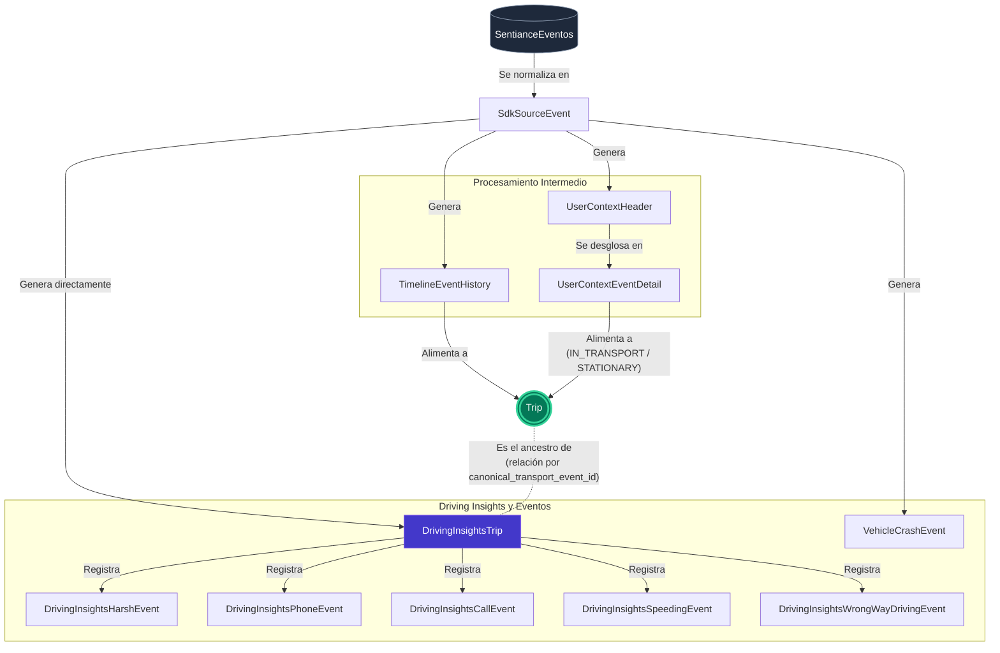

# Arquitectura de Flujo de Datos de Viajes

El siguiente diagrama de flujo de Mermaid ilustra cómo los datos "viajan" y son procesados desde el punto de entrada (la tabla en crudo `SentianceEventos`) hasta llegar a la tabla canónica `Trip` y sus tablas de eventos e insights (conclusiones) asociadas, de acuerdo a la documentación de `Entregable.md`.

## Explicación del Flujo de Datos

1. **Ingesta y Normalización**
    *   Todos los datos aterrizan como un JSON crudo en la tabla de entrada `SentianceEventos`.
    *   Luego, esta información se procesa y se normaliza en los registros formales de procedencia dentro de la tabla `SdkSourceEvent`.

2. **Bifurcación de los Datos**
    *   A partir de `SdkSourceEvent`, la data se ramifica hacia tablas de dominio específicas:
        *   **Eventos de línea de tiempo (Timeline):** Se dirigen a `TimelineEventHistory`.
        *   **Eventos de Contexto de Usuario (User Context):** El payload o mensaje completo va hacia `UserContextHeader`, mientras que el array interno de eventos se desgrana a detalle en la tabla `UserContextEventDetail`.
        *   **Choques de vehículos (Crashes):** Son detectados y almacenados directamente en `VehicleCrashEvent`.
        *   **Puntuación de viajes completados (Scores):** Aterrizan de forma segura en `DrivingInsightsTrip`.

3. **Consolidación del Viaje (Trip)**
    *   Tanto la tabla `TimelineEventHistory` como `UserContextEventDetail` alimentan al modelo canónico u oficial **`Trip`**. Esta tabla primaria consolida todo el viaje (establece su inicio, fin, ubicaciones concretas y el modo de transporte).

4. **Desglose de Insights de Manejo**
    *   Una vez que `DrivingInsightsTrip` recibe las puntuaciones finales de un transporte, funciona como matriz y repositorio padre.
    *   Desde ahí genera o registra incidentes granulares que reflejan qué sucedió exactamente durante la conducción (`Speeding` / Excesos de velocidad, `Harsh Events` / Maniobras bruscas como frenadas y aceleraciones, `Phone Usage` / Uso del teléfono, `Calls while moving` / Llamadas en movimiento, y `Wrong-way driving` / Conducción en contraflujo).
